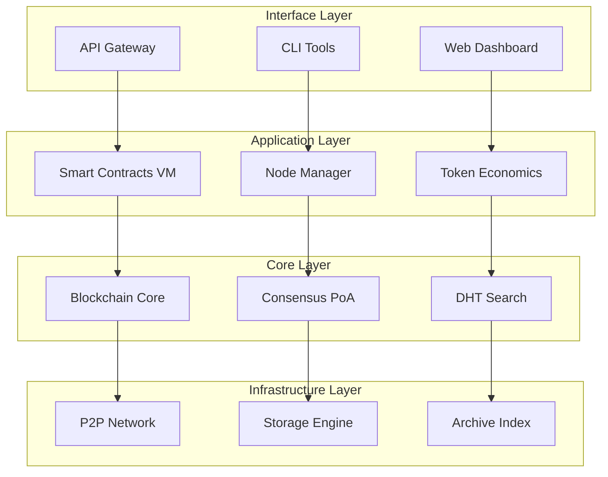
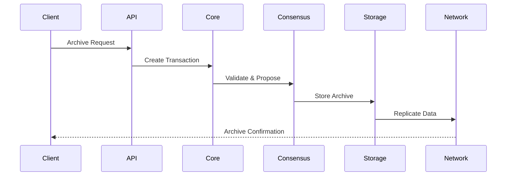

# ArchiveChain - Architecture Technique

## Vue d'ensemble

ArchiveChain est une blockchain native construite en Rust, spécialisée pour l'archivage web décentralisé à l'échelle globale. Elle utilise un consensus Proof of Archive (PoA) innovant et cible les institutions d'archivage, bibliothèques et organisations gouvernementales.

## Principes Architecturaux

- **Modularité** : Architecture en composants indépendants et interchangeables
- **Scalabilité** : Conçue pour supporter des milliers de nœuds globalement
- **Performance** : Optimisée pour les opérations d'archivage et de recherche
- **Sécurité** : Cryptographie forte et mécanismes de consensus robustes
- **Extensibilité** : Support des smart contracts et plugins

## Architecture Modulaire

## Modules Principaux

### 1. Core Blockchain (`core/`)
**Responsabilité** : Gestion des blocs, transactions et état de la chaîne
- Structure des blocs avec métadonnées d'archives
- Pool de transactions optimisé
- Machine d'état déterministe
- Cryptographie et signatures

**Technologies** :
- Rust avec `serde` pour la sérialisation
- `blake3` pour le hachage
- `ed25519-dalek` pour les signatures

### 2. Consensus PoA (`consensus/`)
**Responsabilité** : Implémentation du Proof of Archive
- Proof of Storage : Vérification de l'intégrité des données
- Proof of Bandwidth : Mesure de la capacité réseau
- Proof of Longevity : Évaluation de la durée de stockage
- Algorithme de sélection des validateurs

**Composants** :
- `storage_proof.rs` : Génération et vérification des preuves de stockage
- `bandwidth_proof.rs` : Mesure et validation de la bande passante
- `longevity_tracker.rs` : Suivi de la durée de conservation
- `validator_selection.rs` : Sélection des validateurs PoA

### 3. Storage Engine (`storage/`)
**Responsabilité** : Stockage et réplication intelligente des archives
- Compression et déduplication
- Stratégies de réplication géographique
- Intégrité et récupération des données
- Gestion du cycle de vie des archives

**Sous-modules** :
- `compression/` : Algorithmes de compression adaptés au web
- `replication/` : Stratégies de réplication intelligente
- `integrity/` : Vérification continue de l'intégrité
- `lifecycle/` : Gestion automatisée du cycle de vie

### 4. P2P Network (`network/`)
**Responsabilité** : Communication inter-nœuds
- Protocoles de découverte de pairs
- Routage efficace des messages
- Gestion des connexions persistantes
- Optimisation de la latence

**Technologies** :
- `libp2p` pour la couche P2P
- `tokio` pour l'asynchrone
- `quinn` pour QUIC/HTTP3

### 5. Smart Contracts VM (`smart-contracts/`)
**Responsabilité** : Exécution des contrats d'archivage
- Machine virtuelle WASM
- Bounties d'archivage automatisés
- Pools de préservation communautaires
- Vérification de contenu programmable

**Contrats types** :
- `ArchiveBounty` : Incitations pour l'archivage
- `PreservationPool` : Fonds communautaires
- `ContentValidator` : Validation automatisée

### 6. DHT Search (`search/`)
**Responsabilité** : Recherche distribuée de contenu
- Index distribué par mots-clés
- Recherche sémantique avancée
- Cache de requêtes fréquentes
- Ranking par pertinence et disponibilité

### 7. Node Types Manager (`nodes/`)
**Responsabilité** : Gestion des différents types de nœuds
- **Full Archive** : Stockage complet et validation
- **Light Storage** : Stockage partiel et relais
- **Relay** : Routage et découverte réseau
- **Gateway** : Interface API publique

### 8. API Gateway (`api/`)
**Responsabilité** : Interface publique standardisée
- REST API pour les opérations courantes
- GraphQL pour les requêtes complexes
- WebSocket pour les mises à jour temps réel
- Documentation automatique OpenAPI

### 9. Token Economics (`tokenomics/`)
**Responsabilité** : Économie du token ARC
- Mécanismes d'incitation par l'archivage
- Système déflationniste automatique
- Calcul des récompenses de consensus
- Gestion des frais de transaction

## Flux de Données Principaux

## Types de Nœuds et Responsabilités

| Type | Stockage | Consensus | API | Caractéristiques |
|------|----------|-----------|-----|------------------|
| **Full Archive** | Complet | Participant | Non | Stockage maximal, validation complète |
| **Light Storage** | Partiel | Observer | Non | Stockage économique, relais rapide |
| **Relay** | Minimal | Observer | Non | Routage optimisé, découverte réseau |
| **Gateway** | Cache | Observer | Complet | Interface publique, haute disponibilité |

## Considérations de Sécurité

- **Cryptographie** : Ed25519 pour les signatures, Blake3 pour le hachage
- **Réseau** : TLS 1.3 obligatoire, authentification mutuelle
- **Consensus** : Protection contre les attaques 51% via PoA
- **Storage** : Chiffrement at-rest avec clés rotatives
- **Smart Contracts** : Sandbox WASM avec limitations de ressources

## Métriques et Monitoring

- **Performance** : Latence, débit, utilisation ressources
- **Réseau** : Connectivité, topologie, santé des pairs
- **Consensus** : Temps de finalisation, participation validateurs
- **Storage** : Intégrité données, taux réplication, disponibilité
- **Economics** : Distribution tokens, récompenses, inflation

## Roadmap d'Implémentation

1. **Phase 1** : Core blockchain + P2P basic
2. **Phase 2** : Consensus PoA + Storage engine
3. **Phase 3** : Smart contracts + DHT search
4. **Phase 4** : API publique + Node types
5. **Phase 5** : Token economics + Optimisations