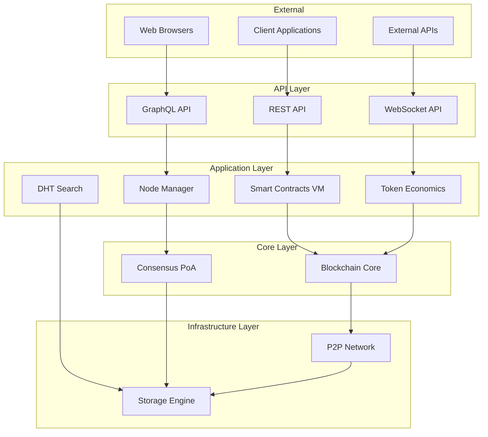
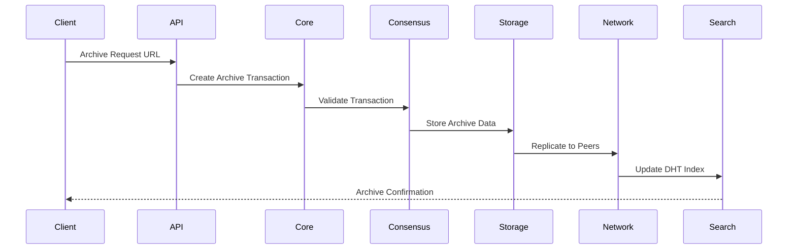
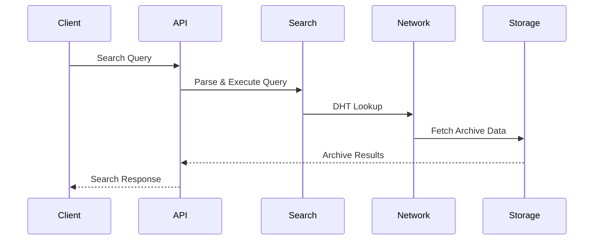
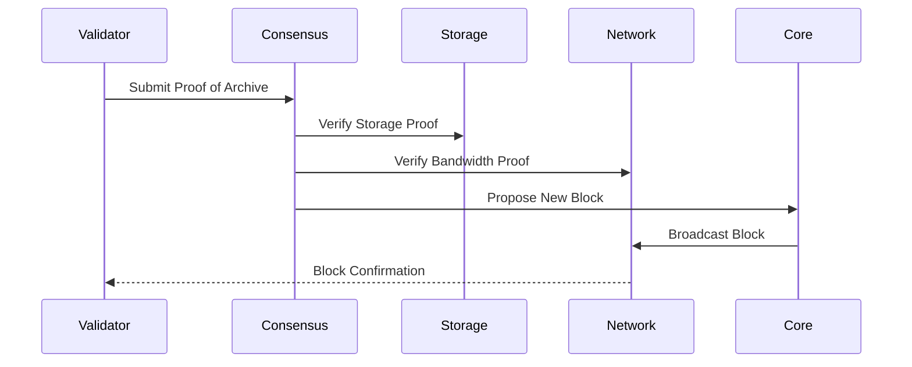

# Schémas de Communication Inter-Modules ArchiveChain

## Vue d'ensemble des Communications

Ce document définit les flux de communication entre les modules d'ArchiveChain, les protocoles utilisés et les interfaces de données.

## Diagramme Global des Communications



## Flux de Communication Détaillés

### 1. Flux d'Archivage Web



### 2. Flux de Recherche Distribuée



### 3. Flux de Consensus PoA



## Interfaces de Communication

### 1. API Layer ↔ Application Layer

#### REST API → Smart Contracts
```rust
// Interface trait
trait SmartContractInterface {
    async fn deploy_contract(&self, bytecode: Vec<u8>) -> Result<ContractId>;
    async fn call_contract(&self, id: ContractId, method: String, args: Vec<u8>) -> Result<Vec<u8>>;
    async fn get_contract_state(&self, id: ContractId) -> Result<ContractState>;
}
```

#### GraphQL API → Node Manager
```rust
// Interface trait
trait NodeManagerInterface {
    async fn get_node_info(&self, node_id: NodeId) -> Result<NodeInfo>;
    async fn list_nodes(&self, filter: NodeFilter) -> Result<Vec<NodeInfo>>;
    async fn get_network_stats(&self) -> Result<NetworkStats>;
}
```

### 2. Application Layer ↔ Core Layer

#### Smart Contracts → Blockchain Core
```rust
// Interface trait
trait BlockchainCoreInterface {
    async fn submit_transaction(&self, tx: Transaction) -> Result<TxHash>;
    async fn get_block(&self, hash: BlockHash) -> Result<Block>;
    async fn get_transaction(&self, hash: TxHash) -> Result<Transaction>;
    async fn get_state(&self, key: StateKey) -> Result<StateValue>;
}
```

#### Node Manager → Consensus
```rust
// Interface trait
trait ConsensusInterface {
    async fn register_validator(&self, info: ValidatorInfo) -> Result<ValidatorId>;
    async fn submit_proof(&self, proof: ArchiveProof) -> Result<ProofId>;
    async fn get_validator_stats(&self, id: ValidatorId) -> Result<ValidatorStats>;
}
```

### 3. Core Layer ↔ Infrastructure Layer

#### Blockchain Core → P2P Network
```rust
// Interface trait
trait NetworkInterface {
    async fn broadcast_transaction(&self, tx: Transaction) -> Result<()>;
    async fn broadcast_block(&self, block: Block) -> Result<()>;
    async fn request_block(&self, hash: BlockHash, peer: PeerId) -> Result<Block>;
    async fn sync_blockchain(&self, from_height: u64) -> Result<Vec<Block>>;
}
```

#### Consensus → Storage Engine
```rust
// Interface trait
trait StorageInterface {
    async fn store_archive(&self, data: ArchiveData) -> Result<ArchiveId>;
    async fn verify_storage(&self, id: ArchiveId) -> Result<StorageProof>;
    async fn replicate_archive(&self, id: ArchiveId, peers: Vec<PeerId>) -> Result<()>;
    async fn get_archive(&self, id: ArchiveId) -> Result<ArchiveData>;
}
```

## Protocoles de Communication

### 1. Protocoles Internes (Inter-modules)

#### Event Bus System
```rust
// Système d'événements asynchrone
pub enum SystemEvent {
    BlockMined(Block),
    TransactionReceived(Transaction),
    ArchiveStored(ArchiveId),
    PeerConnected(PeerId),
    ConsensusReached(BlockHash),
}

pub trait EventBus {
    async fn publish(&self, event: SystemEvent) -> Result<()>;
    async fn subscribe(&self, event_type: EventType) -> Result<EventReceiver>;
}
```

#### Message Passing
```rust
// Communication par messages asynchrones
pub enum InterModuleMessage {
    Core(CoreMessage),
    Consensus(ConsensusMessage),
    Storage(StorageMessage),
    Network(NetworkMessage),
    Search(SearchMessage),
}

pub trait MessageBus {
    async fn send(&self, target: ModuleId, message: InterModuleMessage) -> Result<()>;
    async fn request(&self, target: ModuleId, request: Request) -> Result<Response>;
}
```

### 2. Protocoles Externes (P2P)

#### Gossip Protocol
```rust
// Protocole de diffusion d'informations
pub enum GossipMessage {
    NewTransaction(Transaction),
    NewBlock(Block),
    ArchiveAvailable(ArchiveMetadata),
    ValidatorUpdate(ValidatorInfo),
}

pub trait GossipProtocol {
    async fn gossip(&self, message: GossipMessage) -> Result<()>;
    async fn handle_gossip(&self, peer: PeerId, message: GossipMessage) -> Result<()>;
}
```

#### Request-Response Protocol
```rust
// Protocole requête-réponse direct
pub enum NetworkRequest {
    GetBlock(BlockHash),
    GetTransaction(TxHash),
    GetArchive(ArchiveId),
    GetPeers,
}

pub enum NetworkResponse {
    Block(Block),
    Transaction(Transaction),
    Archive(ArchiveData),
    Peers(Vec<PeerInfo>),
}
```

## Gestion des Erreurs et Retry

### 1. Stratégies de Retry
```rust
// Configuration des tentatives
pub struct RetryConfig {
    pub max_attempts: u32,
    pub base_delay: Duration,
    pub max_delay: Duration,
    pub backoff_factor: f64,
}

pub trait RetryableOperation {
    async fn execute_with_retry(&self, config: RetryConfig) -> Result<Self::Output>;
}
```

### 2. Circuit Breaker Pattern
```rust
// Protection contre les défaillances en cascade
pub struct CircuitBreaker {
    failure_threshold: u32,
    timeout: Duration,
    state: CircuitState,
}

pub enum CircuitState {
    Closed,
    Open,
    HalfOpen,
}
```

## Monitoring et Observabilité

### 1. Métriques de Communication
```rust
// Métriques collectées automatiquement
pub struct CommunicationMetrics {
    pub messages_sent: Counter,
    pub messages_received: Counter,
    pub request_latency: Histogram,
    pub error_rate: Gauge,
    pub active_connections: Gauge,
}
```

### 2. Tracing Distribué
```rust
// Traçage des requêtes inter-modules
use tracing::{span, instrument};

#[instrument(skip(self))]
async fn process_archive_request(&self, request: ArchiveRequest) -> Result<ArchiveId> {
    let span = span!(Level::INFO, "archive_processing", request_id = %request.id);
    // ... logique de traitement
}
```

## Sécurité des Communications

### 1. Authentification Inter-Modules
```rust
// Authentification basée sur des tokens JWT
pub struct ModuleAuth {
    private_key: PrivateKey,
    public_keys: HashMap<ModuleId, PublicKey>,
}

impl ModuleAuth {
    pub fn sign_message(&self, message: &[u8]) -> Signature;
    pub fn verify_message(&self, sender: ModuleId, message: &[u8], sig: &Signature) -> bool;
}
```

### 2. Chiffrement des Communications
```rust
// Chiffrement bout en bout pour les données sensibles
pub struct SecureChannel {
    encryption_key: SymmetricKey,
    mac_key: MacKey,
}

impl SecureChannel {
    pub fn encrypt(&self, data: &[u8]) -> Vec<u8>;
    pub fn decrypt(&self, encrypted: &[u8]) -> Result<Vec<u8>>;
}
```

## Configuration des Communications

### 1. Configuration Réseau
```toml
[network]
listen_address = "0.0.0.0:8080"
max_connections = 1000
connection_timeout = "30s"
keepalive_interval = "60s"

[network.discovery]
bootstrap_nodes = [
    "/ip4/127.0.0.1/tcp/8081/p2p/12D3KooWBmwcr..."
]
mdns_enabled = true
```

### 2. Configuration Inter-Modules
```toml
[communication]
event_bus_size = 10000
message_timeout = "30s"
max_retry_attempts = 3
retry_backoff = "exponential"

[communication.modules]
core_address = "tcp://127.0.0.1:9001"
consensus_address = "tcp://127.0.0.1:9002"
storage_address = "tcp://127.0.0.1:9003"
```

## Tests de Communication

### 1. Tests d'Intégration
```rust
#[tokio::test]
async fn test_end_to_end_archive_flow() {
    let system = setup_test_system().await;
    
    // Test du flux complet d'archivage
    let archive_request = ArchiveRequest::new("https://example.com");
    let archive_id = system.api.submit_archive(archive_request).await?;
    
    // Vérification de la propagation dans tous les modules
    assert!(system.storage.has_archive(archive_id).await);
    assert!(system.search.is_indexed(archive_id).await);
    assert!(system.consensus.is_validated(archive_id).await);
}
```

### 2. Tests de Charge
```rust
#[tokio::test]
async fn test_high_throughput_communication() {
    let system = setup_test_system().await;
    
    // Test avec 1000 requêtes simultanées
    let tasks: Vec<_> = (0..1000)
        .map(|i| {
            let api = system.api.clone();
            tokio::spawn(async move {
                api.submit_archive(ArchiveRequest::new(&format!("https://test{}.com", i))).await
            })
        })
        .collect();
    
    let results = futures::future::join_all(tasks).await;
    assert!(results.iter().all(|r| r.is_ok()));
}
```

## Optimisations de Performance

### 1. Connection Pooling
```rust
// Pool de connexions réutilisables
pub struct ConnectionPool {
    connections: Arc<Mutex<Vec<Connection>>>,
    max_size: usize,
    min_size: usize,
}
```

### 2. Batching des Messages
```rust
// Regroupement de messages pour optimiser les performances
pub struct MessageBatcher {
    pending_messages: Vec<Message>,
    batch_size: usize,
    flush_interval: Duration,
}
```

### 3. Compression des Données
```rust
// Compression automatique des gros messages
pub struct CompressedTransport {
    compression_threshold: usize,
    algorithm: CompressionAlgorithm,
}