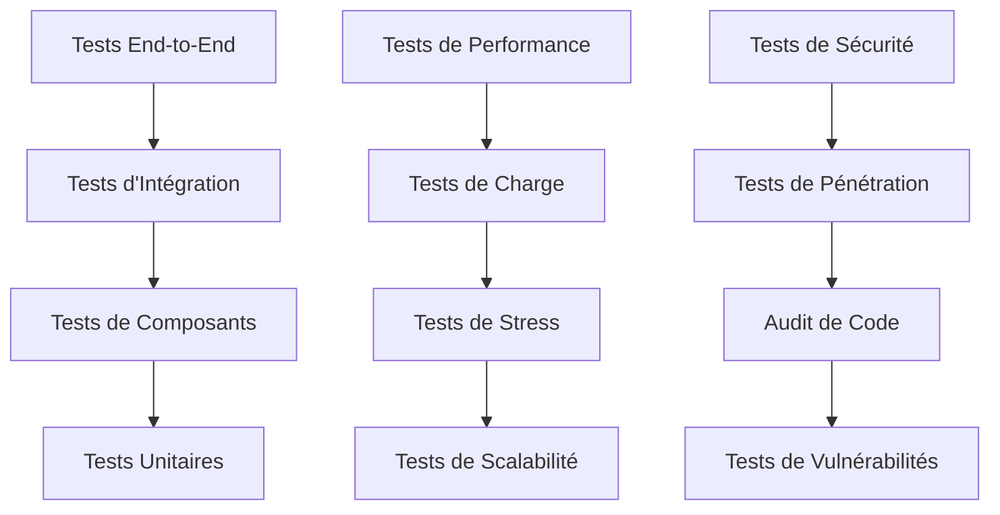

# Stratégie de Tests et Documentation ArchiveChain

## Vue d'ensemble de la Stratégie de Tests

La stratégie de tests d'ArchiveChain suit une approche pyramidale avec plusieurs niveaux de tests pour garantir la qualité, la performance et la sécurité du système.



## 1. Tests Unitaires

### Structure et Organisation
```
tests/unit/
├── core/
│   ├── block_tests.rs
│   ├── transaction_tests.rs
│   ├── state_tests.rs
│   └── crypto_tests.rs
├── consensus/
│   ├── poa_tests.rs
│   ├── proof_storage_tests.rs
│   ├── proof_bandwidth_tests.rs
│   └── validator_tests.rs
├── storage/
│   ├── engine_tests.rs
│   ├── compression_tests.rs
│   ├── replication_tests.rs
│   └── integrity_tests.rs
├── network/
│   ├── p2p_tests.rs
│   ├── discovery_tests.rs
│   ├── routing_tests.rs
│   └── security_tests.rs
└── utils/
    ├── fixtures.rs
    ├── mocks.rs
    └── helpers.rs
```

### Exemples de Tests Unitaires
```rust
// core/block_tests.rs
#[cfg(test)]
mod block_tests {
    use super::*;
    use archivechain_core::block::{Block, BlockHeader};
    use archivechain_core::crypto::Hash;

    #[test]
    fn test_block_creation() {
        let header = BlockHeader {
            height: 1,
            previous_hash: Hash::zero(),
            timestamp: 1640995200,
            merkle_root: Hash::zero(),
        };
        
        let block = Block::new(header, vec![]);
        
        assert_eq!(block.height(), 1);
        assert_eq!(block.transactions().len(), 0);
        assert!(block.validate_structure().is_ok());
    }

    #[test]
    fn test_block_hash_consistency() {
        let block = create_test_block();
        let hash1 = block.hash();
        let hash2 = block.hash();
        
        assert_eq!(hash1, hash2);
    }

    #[tokio::test]
    async fn test_block_validation() {
        let mut block = create_test_block();
        block.add_transaction(create_test_transaction());
        
        let result = block.validate().await;
        assert!(result.is_ok());
    }
}

// consensus/poa_tests.rs
#[cfg(test)]
mod poa_tests {
    use super::*;
    use archivechain_consensus::poa::{ProofOfArchive, ArchiveProof};

    #[tokio::test]
    async fn test_storage_proof_generation() {
        let archive_data = create_test_archive_data();
        let proof = ProofOfArchive::generate_storage_proof(&archive_data).await?;
        
        assert!(proof.verify_storage(&archive_data).await?);
    }

    #[test]
    fn test_validator_selection() {
        let validators = create_test_validators(10);
        let selected = ProofOfArchive::select_validators(&validators, 3);
        
        assert_eq!(selected.len(), 3);
        assert!(selected.iter().all(|v| validators.contains(v)));
    }
}
```

### Configuration des Tests
```toml
# Cargo.toml - Configuration globale des tests
[workspace]
members = [
    "core",
    "consensus", 
    "storage",
    # ... autres modules
]

[workspace.dependencies]
tokio-test = "0.4"
mockall = "0.11"
proptest = "1.0"
criterion = "0.5"

# Dans chaque module
[dev-dependencies]
tokio-test = { workspace = true }
mockall = { workspace = true }
proptest = { workspace = true }
tempfile = "3.0"
```

## 2. Tests d'Intégration

### Structure des Tests d'Intégration
```
tests/integration/
├── blockchain/
│   ├── full_node_integration.rs
│   ├── consensus_integration.rs
│   └── state_sync_integration.rs
├── storage/
│   ├── archive_lifecycle.rs
│   ├── replication_integration.rs
│   └── integrity_verification.rs
├── network/
│   ├── peer_discovery.rs
│   ├── message_propagation.rs
│   └── network_partitioning.rs
├── api/
│   ├── rest_api_integration.rs
│   ├── graphql_integration.rs
│   └── websocket_integration.rs
└── fixtures/
    ├── test_data/
    ├── configs/
    └── keys/
```

### Exemples de Tests d'Intégration
```rust
// integration/blockchain/full_node_integration.rs
#[tokio::test]
async fn test_full_archive_node_lifecycle() {
    let test_env = TestEnvironment::new().await;
    
    // Démarrer un nœud Full Archive
    let node = test_env.start_full_archive_node().await?;
    
    // Soumettre une archive
    let archive_request = ArchiveRequest::new("https://example.com");
    let archive_id = node.submit_archive(archive_request).await?;
    
    // Vérifier le traitement
    wait_for_archive_completion(&node, archive_id, Duration::from_secs(30)).await?;
    
    // Vérifier le stockage
    let archive = node.get_archive(archive_id).await?;
    assert_eq!(archive.status, ArchiveStatus::Completed);
    assert!(archive.replicas >= 3);
    
    // Vérifier l'indexation
    let search_results = node.search("example.com").await?;
    assert!(!search_results.is_empty());
    
    test_env.cleanup().await;
}

// integration/network/peer_discovery.rs
#[tokio::test]
async fn test_peer_discovery_and_connection() {
    let mut network = TestNetwork::new().await;
    
    // Démarrer 5 nœuds
    let nodes = network.start_nodes(5).await?;
    
    // Attendre la découverte mutuelle
    tokio::time::sleep(Duration::from_secs(10)).await;
    
    // Vérifier les connexions
    for node in &nodes {
        let peers = node.get_connected_peers().await?;
        assert!(peers.len() >= 2); // Au moins 2 connexions
    }
    
    // Test de résilience - Déconnecter un nœud
    network.disconnect_node(nodes[0].id()).await?;
    tokio::time::sleep(Duration::from_secs(5)).await;
    
    // Vérifier que le réseau reste connecté
    for node in &nodes[1..] {
        let peers = node.get_connected_peers().await?;
        assert!(!peers.is_empty());
    }
    
    network.cleanup().await;
}
```

## 3. Tests End-to-End

### Scénarios E2E Principaux
```rust
// tests/e2e/archive_workflow.rs
#[tokio::test]
#[ignore = "e2e"] // Exécuté séparément
async fn test_complete_archive_workflow() {
    let cluster = TestCluster::new(3).await; // 3 nœuds
    
    // 1. Client soumet une archive via REST API
    let client = cluster.api_client();
    let response = client.post("/v1/archives")
        .json(&json!({
            "url": "https://example.com/test-page",
            "options": {
                "include_assets": true,
                "max_depth": 2
            }
        }))
        .send()
        .await?;
    
    assert_eq!(response.status(), 201);
    let archive: Archive = response.json().await?;
    
    // 2. Attendre le traitement complet
    let mut status = ArchiveStatus::Pending;
    for _ in 0..60 { // Max 5 minutes
        tokio::time::sleep(Duration::from_secs(5)).await;
        let response = client.get(&format!("/v1/archives/{}", archive.id))
            .send()
            .await?;
        let current_archive: Archive = response.json().await?;
        status = current_archive.status;
        if status == ArchiveStatus::Completed {
            break;
        }
    }
    
    assert_eq!(status, ArchiveStatus::Completed);
    
    // 3. Vérifier la recherche
    let search_response = client.get("/v1/search")
        .query(&[("q", "test-page")])
        .send()
        .await?;
    
    assert_eq!(search_response.status(), 200);
    let search_results: SearchResponse = search_response.json().await?;
    assert!(!search_results.results.is_empty());
    
    // 4. Vérifier l'accès via Gateway
    let gateway_url = format!("https://gateway.{}/view/{}", 
                             cluster.gateway_domain(), archive.id);
    let content_response = reqwest::get(&gateway_url).await?;
    assert_eq!(content_response.status(), 200);
    
    cluster.cleanup().await;
}
```

## 4. Tests de Performance

### Benchmarks avec Criterion
```rust
// benches/consensus_benchmark.rs
use criterion::{black_box, criterion_group, criterion_main, Criterion};
use archivechain_consensus::poa::ProofOfArchive;

fn benchmark_proof_generation(c: &mut Criterion) {
    let runtime = tokio::runtime::Runtime::new().unwrap();
    let archive_data = create_benchmark_archive_data();
    
    c.bench_function("storage_proof_generation", |b| {
        b.to_async(&runtime).iter(|| async {
            let proof = ProofOfArchive::generate_storage_proof(
                black_box(&archive_data)
            ).await.unwrap();
            black_box(proof)
        })
    });
}

fn benchmark_proof_verification(c: &mut Criterion) {
    let runtime = tokio::runtime::Runtime::new().unwrap();
    let (archive_data, proof) = runtime.block_on(async {
        let data = create_benchmark_archive_data();
        let proof = ProofOfArchive::generate_storage_proof(&data).await.unwrap();
        (data, proof)
    });
    
    c.bench_function("storage_proof_verification", |b| {
        b.to_async(&runtime).iter(|| async {
            let result = black_box(&proof).verify_storage(
                black_box(&archive_data)
            ).await.unwrap();
            black_box(result)
        })
    });
}

criterion_group!(benches, benchmark_proof_generation, benchmark_proof_verification);
criterion_main!(benches);
```

### Tests de Charge
```rust
// tests/load/network_load_test.rs
#[tokio::test]
#[ignore = "load"]
async fn test_high_volume_archive_processing() {
    let cluster = TestCluster::new(5).await;
    let client = cluster.api_client();
    
    // Configuration du test de charge
    let concurrent_requests = 100;
    let total_archives = 1000;
    let batch_size = total_archives / concurrent_requests;
    
    let start_time = Instant::now();
    let mut tasks = Vec::new();
    
    // Lancer les tâches concurrentes
    for batch in 0..concurrent_requests {
        let client_clone = client.clone();
        let task = tokio::spawn(async move {
            let mut results = Vec::new();
            for i in 0..batch_size {
                let url = format!("https://test{}.example.com", batch * batch_size + i);
                let response = client_clone.post("/v1/archives")
                    .json(&json!({"url": url}))
                    .send()
                    .await?;
                results.push(response.status() == 201);
            }
            Ok::<_, reqwest::Error>(results)
        });
        tasks.push(task);
    }
    
    // Attendre les résultats
    let results = futures::future::join_all(tasks).await;
    let duration = start_time.elapsed();
    
    // Analyser les résultats
    let mut total_success = 0;
    for result in results {
        let batch_results = result.unwrap().unwrap();
        total_success += batch_results.iter().filter(|&&success| success).count();
    }
    
    let success_rate = total_success as f64 / total_archives as f64;
    let throughput = total_archives as f64 / duration.as_secs_f64();
    
    println!("Taux de succès: {:.2}%", success_rate * 100.0);
    println!("Débit: {:.2} requêtes/sec", throughput);
    
    // Assertions
    assert!(success_rate >= 0.95); // Au moins 95% de succès
    assert!(throughput >= 10.0);   // Au moins 10 req/sec
    
    cluster.cleanup().await;
}
```

## 5. Tests de Sécurité

### Tests de Vulnérabilités
```rust
// tests/security/consensus_security.rs
#[tokio::test]
async fn test_consensus_attack_resistance() {
    let mut network = TestNetwork::new().await;
    
    // Créer un réseau avec des nœuds honnêtes et malveillants
    let honest_nodes = network.start_honest_nodes(7).await?;
    let malicious_nodes = network.start_malicious_nodes(3).await?;
    
    // Test d'attaque 51% (qui devrait échouer)
    let malicious_block = create_invalid_block();
    for node in &malicious_nodes {
        node.propose_block(malicious_block.clone()).await?;
    }
    
    // Attendre la finalisation du consensus
    tokio::time::sleep(Duration::from_secs(30)).await;
    
    // Vérifier que le bloc malveillant est rejeté
    for node in &honest_nodes {
        let chain = node.get_blockchain().await?;
        assert!(!chain.contains_block(malicious_block.hash()));
    }
    
    network.cleanup().await;
}

// tests/security/api_security.rs
#[tokio::test]
async fn test_api_authentication_and_authorization() {
    let server = TestApiServer::new().await;
    let client = reqwest::Client::new();
    
    // Test sans authentification
    let response = client.get(&format!("{}/v1/archives", server.url()))
        .send()
        .await?;
    assert_eq!(response.status(), 401);
    
    // Test avec token invalide
    let response = client.get(&format!("{}/v1/archives", server.url()))
        .header("Authorization", "Bearer invalid-token")
        .send()
        .await?;
    assert_eq!(response.status(), 401);
    
    // Test avec permissions insuffisantes
    let limited_token = server.create_token(&["archives:read"]).await?;
    let response = client.post(&format!("{}/v1/archives", server.url()))
        .header("Authorization", &format!("Bearer {}", limited_token))
        .json(&json!({"url": "https://example.com"}))
        .send()
        .await?;
    assert_eq!(response.status(), 403);
    
    // Test avec permissions correctes
    let full_token = server.create_token(&["archives:read", "archives:write"]).await?;
    let response = client.post(&format!("{}/v1/archives", server.url()))
        .header("Authorization", &format!("Bearer {}", full_token))
        .json(&json!({"url": "https://example.com"}))
        .send()
        .await?;
    assert_eq!(response.status(), 201);
    
    server.cleanup().await;
}
```

## 6. Tests de Propriétés (Property-Based Testing)

```rust
// tests/property/block_properties.rs
use proptest::prelude::*;

proptest! {
    #[test]
    fn test_block_hash_deterministic(
        height in 1u64..1000000,
        timestamp in 1640995200u64..2000000000,
        transactions in prop::collection::vec(any::<Transaction>(), 0..100)
    ) {
        let block1 = Block::new(height, timestamp, transactions.clone());
        let block2 = Block::new(height, timestamp, transactions);
        
        prop_assert_eq!(block1.hash(), block2.hash());
    }
    
    #[test]
    fn test_archive_compression_ratio(
        data in prop::collection::vec(any::<u8>(), 1000..100000)
    ) {
        let compressed = compress_archive_data(&data)?;
        let decompressed = decompress_archive_data(&compressed)?;
        
        prop_assert_eq!(data, decompressed);
        prop_assert!(compressed.len() <= data.len()); // Compression efficace
    }
}
```

## 7. Documentation et Guides

### Structure de la Documentation
```
docs/
├── architecture/
│   ├── README.md
│   ├── consensus.md
│   ├── storage.md
│   ├── network.md
│   └── security.md
├── api/
│   ├── README.md
│   ├── rest-api.md
│   ├── graphql.md
│   ├── websocket.md
│   └── examples/
├── deployment/
│   ├── README.md
│   ├── docker.md
│   ├── kubernetes.md
│   ├── cloud-providers.md
│   └── monitoring.md
├── development/
│   ├── README.md
│   ├── setup.md
│   ├── contributing.md
│   ├── coding-standards.md
│   └── testing.md
├── user-guides/
│   ├── README.md
│   ├── getting-started.md
│   ├── archiving-websites.md
│   ├── searching.md
│   └── node-operation.md
└── tutorials/
    ├── README.md
    ├── first-archive.md
    ├── setting-up-node.md
    ├── api-integration.md
    └── smart-contracts.md
```

### Documentation Automatique
```rust
// Génération automatique de documentation API
#[utoipa::path(
    post,
    path = "/archives",
    request_body = CreateArchiveRequest,
    responses(
        (status = 201, description = "Archive created successfully", body = Archive),
        (status = 400, description = "Invalid request", body = ErrorResponse),
        (status = 401, description = "Unauthorized", body = ErrorResponse)
    ),
    tag = "Archives"
)]
pub async fn create_archive(
    Json(request): Json<CreateArchiveRequest>
) -> Result<Json<Archive>, ApiError> {
    // Implémentation
}

// Documentation des structures de données
/// Représente une archive dans le système ArchiveChain
#[derive(Debug, Serialize, Deserialize, ToSchema)]
pub struct Archive {
    /// Identifiant unique de l'archive
    #[schema(example = "arc_1234567890abcdef")]
    pub id: String,
    
    /// URL originale archivée
    #[schema(example = "https://example.com")]
    pub url: String,
    
    /// Statut actuel de l'archive
    pub status: ArchiveStatus,
    
    /// Métadonnées de l'archive
    pub metadata: ArchiveMetadata,
}
```

## 8. CI/CD et Automatisation

### GitHub Actions Workflow
```yaml
# .github/workflows/test.yml
name: Tests

on:
  push:
    branches: [ main, develop ]
  pull_request:
    branches: [ main ]

jobs:
  unit-tests:
    runs-on: ubuntu-latest
    strategy:
      matrix:
        rust: [stable, beta]
    
    steps:
      - uses: actions/checkout@v3
      
      - name: Install Rust
        uses: actions-rs/toolchain@v1
        with:
          toolchain: ${{ matrix.rust }}
          components: rustfmt, clippy
          
      - name: Cache cargo registry
        uses: actions/cache@v3
        with:
          path: ~/.cargo/registry
          key: ${{ runner.os }}-cargo-registry-${{ hashFiles('**/Cargo.lock') }}
          
      - name: Run unit tests
        run: cargo test --all --lib
        
      - name: Run doctests
        run: cargo test --all --doc
        
      - name: Check formatting
        run: cargo fmt --all -- --check
        
      - name: Run clippy
        run: cargo clippy --all -- -D warnings

  integration-tests:
    runs-on: ubuntu-latest
    services:
      redis:
        image: redis:6
        options: >-
          --health-cmd "redis-cli ping"
          --health-interval 10s
          --health-timeout 5s
          --health-retries 5
    
    steps:
      - uses: actions/checkout@v3
      
      - name: Setup test environment
        run: |
          docker-compose -f docker/test-compose.yml up -d
          
      - name: Run integration tests
        run: cargo test --test '*' -- --test-threads=1
        
      - name: Cleanup
        run: docker-compose -f docker/test-compose.yml down

  security-audit:
    runs-on: ubuntu-latest
    steps:
      - uses: actions/checkout@v3
      
      - name: Security audit
        uses: actions-rs/audit@v1
        
      - name: Run vulnerability scan
        run: |
          cargo install cargo-audit
          cargo audit
```

### Métriques de Couverture
```toml
# Cargo.toml - Configuration pour la couverture de code
[profile.dev]
opt-level = 0
debug = true
overflow-checks = true

[profile.test]
opt-level = 1
debug = true
overflow-checks = true

# Installation: cargo install cargo-tarpaulin
# Exécution: cargo tarpaulin --out Html --output-dir coverage
```

## 9. Monitoring et Observabilité des Tests

### Métriques de Tests
```rust
// tests/utils/metrics.rs
pub struct TestMetrics {
    pub execution_time: Duration,
    pub memory_usage: u64,
    pub network_requests: u32,
    pub assertions_count: u32,
}

impl TestMetrics {
    pub fn collect() -> Self {
        // Collecte des métriques pendant l'exécution des tests
    }
    
    pub fn report(&self) {
        println!("Test Metrics:");
        println!("  Execution time: {:?}", self.execution_time);
        println!("  Memory usage: {} MB", self.memory_usage / 1024 / 1024);
        println!("  Network requests: {}", self.network_requests);
        println!("  Assertions: {}", self.assertions_count);
    }
}
```

### Dashboard de Tests
```rust
// Intégration avec Prometheus pour le monitoring des tests
use prometheus::{Counter, Histogram, register_counter, register_histogram};

lazy_static! {
    static ref TEST_COUNTER: Counter = register_counter!(
        "test_executions_total",
        "Total number of test executions"
    ).unwrap();
    
    static ref TEST_DURATION: Histogram = register_histogram!(
        "test_duration_seconds",
        "Test execution duration"
    ).unwrap();
}

pub fn record_test_execution(duration: Duration) {
    TEST_COUNTER.inc();
    TEST_DURATION.observe(duration.as_secs_f64());
}
```

Ce plan de tests complet garantit la qualité, la performance et la sécurité d'ArchiveChain à tous les niveaux du système.