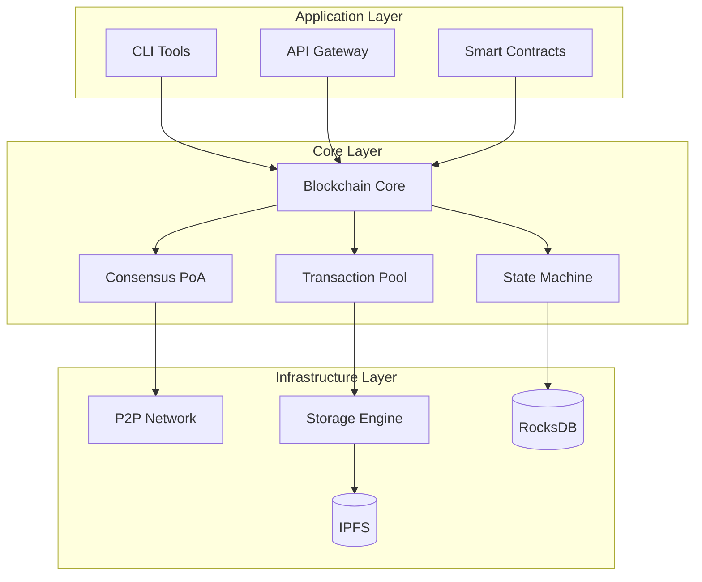

# Guide du Développeur ArchiveChain

## Table des Matières

- [Vue d'Ensemble](#vue-densemble)
- [Architecture Technique](#architecture-technique)
- [Configuration de Développement](#configuration-de-développement)
- [Core Blockchain](#core-blockchain)
- [Consensus Proof of Archive](#consensus-proof-of-archive)
- [Smart Contracts WASM](#smart-contracts-wasm)
- [APIs et Intégrations](#apis-et-intégrations)
- [Tests et Qualité](#tests-et-qualité)
- [Contribution au Projet](#contribution-au-projet)
- [Ressources Avancées](#ressources-avancées)

## Vue d'Ensemble

ArchiveChain est une blockchain native construite en **Rust** pour l'archivage web décentralisé. Ce guide fournit toutes les informations nécessaires pour comprendre, modifier et contribuer au codebase.

### Principes de Design

🏗️ **Modularité** - Architecture en modules indépendants  
⚡ **Performance** - Optimisée pour l'archivage haute volume  
🔒 **Sécurité** - Cryptographie robuste et validation stricte  
🌐 **Scalabilité** - Conçue pour des milliers de nœuds  
🔧 **Extensibilité** - Support des plugins et smart contracts  

### Stack Technologique

```yaml
Langage Principal: Rust 1.70+ (Edition 2021)
Consensus: Proof of Archive (PoA) custom
Storage: Multi-backend (Local, IPFS, S3)
Networking: libp2p avec QUIC/TCP
Smart Contracts: WASM avec Wasmtime
APIs: REST, GraphQL, WebSocket, gRPC
Database: RocksDB + Custom indexes
Serialization: Serde avec formats binaires
Cryptography: Ed25519, Blake3, AES-256
```

## Architecture Technique

### Structure Modulaire

```
archivechain/
├── core/                   # Blockchain core
│   ├── block/             # Types et validation des blocs
│   ├── transaction/       # Pool et validation des transactions
│   ├── state/             # Machine d'état et Merkle trees
│   ├── crypto/            # Primitives cryptographiques
│   ├── consensus/         # Moteur Proof of Archive
│   ├── storage/           # Backends de stockage
│   ├── nodes/             # Types de nœuds spécialisés
│   ├── contracts/         # VM et runtime WASM
│   ├── token/             # Système économique ARC
│   └── api/               # Interfaces API
├── tools/                 # Outils de développement
│   ├── cli/               # Interface ligne de commande
│   ├── keygen/            # Générateur de clés
│   └── benchmark/         # Outils de performance
└── tests/                 # Tests d'intégration
```

### Diagramme d'Architecture



### Types de Données Fondamentaux

#### Block Structure
```rust
use serde::{Deserialize, Serialize};
use blake3::Hash;
use ed25519_dalek::PublicKey;

#[derive(Debug, Clone, Serialize, Deserialize)]
pub struct Block {
    pub header: BlockHeader,
    pub body: BlockBody,
}

#[derive(Debug, Clone, Serialize, Deserialize)]
pub struct BlockHeader {
    pub version: u32,
    pub height: u64,
    pub previous_hash: Hash,
    pub merkle_root: Hash,
    pub timestamp: u64,
    pub nonce: u64,
    pub difficulty: u64,
    pub validator: PublicKey,
    pub signature: Signature,
}

#[derive(Debug, Clone, Serialize, Deserialize)]
pub struct BlockBody {
    pub transactions: Vec<Transaction>,
    pub archive_proofs: Vec<ArchiveProof>,
    pub consensus_data: ConsensusData,
}
```

#### Transaction Types
```rust
#[derive(Debug, Clone, Serialize, Deserialize)]
pub enum Transaction {
    Archive(ArchiveTransaction),
    Transfer(TransferTransaction),
    Stake(StakeTransaction),
    Contract(ContractTransaction),
    Governance(GovernanceTransaction),
}

#[derive(Debug, Clone, Serialize, Deserialize)]
pub struct ArchiveTransaction {
    pub id: TransactionId,
    pub sender: PublicKey,
    pub url: String,
    pub metadata: ArchiveMetadata,
    pub storage_requirements: StorageRequirements,
    pub fee: u64,
    pub signature: Signature,
}

#[derive(Debug, Clone, Serialize, Deserialize)]
pub struct ArchiveMetadata {
    pub title: Option<String>,
    pub description: Option<String>,
    pub tags: Vec<String>,
    pub content_type: String,
    pub expected_size: u64,
    pub priority: Priority,
    pub retention_period: RetentionPeriod,
}
```

## Configuration de Développement

### Setup Initial

```bash
# Cloner le repository
git clone https://github.com/archivechain/archivechain.git
cd archivechain

# Installer Rust via rustup
curl --proto '=https' --tlsv1.2 -sSf https://sh.rustup.rs | sh
source ~/.cargo/env

# Installer les composants nécessaires
rustup component add rustfmt clippy
rustup target add wasm32-unknown-unknown

# Installer les outils de développement
cargo install cargo-watch cargo-audit cargo-deny
cargo install wasm-pack
```

### Configuration IDE (VS Code)

```json
// .vscode/settings.json
{
  "rust-analyzer.cargo.features": "all",
  "rust-analyzer.check.command": "clippy",
  "rust-analyzer.check.extraArgs": ["--all-targets"],
  "rust-analyzer.imports.granularity.group": "module",
  "rust-analyzer.completion.autoimport.enable": true,
  "editor.formatOnSave": true,
  "files.watcherExclude": {
    "**/target/**": true
  }
}
```

```json
// .vscode/extensions.json
{
  "recommendations": [
    "rust-lang.rust-analyzer",
    "vadimcn.vscode-lldb",
    "serayuzgur.crates",
    "tamasfe.even-better-toml"
  ]
}
```

### Variables d'Environnement

```bash
# .env.development
export RUST_LOG=archivechain=debug,libp2p=info
export ARCHIVECHAIN_DATA_DIR=./data/dev
export ARCHIVECHAIN_NETWORK=devnet
export ARCHIVECHAIN_API_PORT=8080
export ARCHIVECHAIN_P2P_PORT=9090
export ARCHIVECHAIN_METRICS_PORT=9999

# Bases de données de test
export ARCHIVECHAIN_DB_URL=./data/dev/db
export ARCHIVECHAIN_IPFS_API=/ip4/127.0.0.1/tcp/5001

# Clés de développement (NE PAS utiliser en production)
export ARCHIVECHAIN_DEV_PRIVATE_KEY=./keys/dev_private_key.pem
export ARCHIVECHAIN_JWT_SECRET=dev_secret_key_change_in_production
```

### Makefile de Développement

```makefile
# Makefile
.PHONY: all build test lint clean dev docker

# Default target
all: build test

# Build optimisé pour développement
dev:
	cargo build
	
# Build optimisé pour production
build:
	cargo build --release

# Tests complets
test:
	cargo test --all --features "test-utils"
	
# Tests avec coverage
test-coverage:
	cargo tarpaulin --all --out Html --output-dir coverage

# Linting et formatage
lint:
	cargo clippy --all-targets --all-features -- -D warnings
	cargo fmt --all -- --check
	cargo audit
	cargo deny check

# Formatage automatique
format:
	cargo fmt --all

# Nettoyage
clean:
	cargo clean
	rm -rf data/dev target/

# Développement avec auto-rebuild
watch:
	cargo watch -x 'build' -x 'test --lib'

# Serveur de développement
dev-server:
	cargo run --bin archivechain-node -- \
		--config config/dev.toml \
		--log-level debug

# Tests d'intégration
integration-test:
	cargo test --test integration -- --nocapture

# Benchmark
benchmark:
	cargo bench

# Documentation
docs:
	cargo doc --all --no-deps --open

# Docker de développement
docker-dev:
	docker build -f docker/Dockerfile.dev -t archivechain:dev .
	docker run -it --rm -p 8080:8080 -p 9090:9090 archivechain:dev
```

## Smart Contracts WASM

### Types de Contrats Prédéfinis

#### Archive Bounty Contract
```rust
// core/src/contracts/types.rs

#[derive(Debug, Clone, Serialize, Deserialize)]
pub struct ArchiveBounty {
    pub id: BountyId,
    pub creator: PublicKey,
    pub url_pattern: String,
    pub reward_per_archive: u64,
    pub total_budget: u64,
    pub remaining_budget: u64,
    pub requirements: BountyRequirements,
    pub deadline: Option<u64>,
    pub status: BountyStatus,
}

#[derive(Debug, Clone, Serialize, Deserialize)]
pub struct BountyRequirements {
    pub min_storage_duration: Duration,
    pub min_replication_factor: u8,
    pub quality_threshold: f64,
    pub allowed_node_types: Vec<NodeType>,
    pub geographic_distribution: Option<Vec<String>>,
}

impl ArchiveBounty {
    pub fn can_claim(&self, archive: &ArchiveRecord, claimer: &PublicKey) -> bool {
        // Check if bounty is still active
        if self.status != BountyStatus::Active {
            return false;
        }

        // Check budget
        if self.remaining_budget < self.reward_per_archive {
            return false;
        }

        // Check deadline
        if let Some(deadline) = self.deadline {
            let now = SystemTime::now()
                .duration_since(UNIX_EPOCH)
                .unwrap()
                .as_secs();
            if now > deadline {
                return false;
            }
        }

        // Check URL pattern match
        if !self.url_matches_pattern(&archive.url) {
            return false;
        }

        // Check storage duration
        let storage_duration = Duration::from_secs(
            archive.storage_info.total_duration()
        );
        if storage_duration < self.requirements.min_storage_duration {
            return false;
        }

        // Check replication factor
        if archive.replicas.len() < self.requirements.min_replication_factor as usize {
            return false;
        }

        // Check quality threshold
        if archive.storage_info.quality_score < self.requirements.quality_threshold {
            return false;
        }

        true
    }

    fn url_matches_pattern(&self, url: &str) -> bool {
        // Simple glob pattern matching
        if self.url_pattern.contains('*') {
            let pattern = self.url_pattern.replace('*', ".*");
            regex::Regex::new(&pattern)
                .map(|re| re.is_match(url))
                .unwrap_or(false)
        } else {
            url == self.url_pattern
        }
    }
}
```

## APIs et Intégrations

### Structure des APIs

```rust
// core/src/api/mod.rs
pub mod rest;
pub mod graphql;
pub mod websocket;
pub mod grpc;
pub mod p2p;

use crate::prelude::*;

pub struct ApiGateway {
    rest_server: rest::RestServer,
    graphql_server: graphql::GraphQLServer,
    websocket_server: websocket::WebSocketServer,
    grpc_server: grpc::GrpcServer,
    state: Arc<RwLock<State>>,
}

impl ApiGateway {
    pub async fn new(config: ApiConfig, state: Arc<RwLock<State>>) -> Result<Self> {
        let rest_server = rest::RestServer::new(
            config.rest.clone(),
            state.clone()
        ).await?;

        let graphql_server = graphql::GraphQLServer::new(
            config.graphql.clone(),
            state.clone()
        ).await?;

        let websocket_server = websocket::WebSocketServer::new(
            config.websocket.clone(),
            state.clone()
        ).await?;

        let grpc_server = grpc::GrpcServer::new(
            config.grpc.clone(),
            state.clone()
        ).await?;

        Ok(Self {
            rest_server,
            graphql_server,
            websocket_server,
            grpc_server,
            state,
        })
    }

    pub async fn start(&mut self) -> Result<()> {
        // Start all API servers concurrently
        tokio::try_join!(
            self.rest_server.start(),
            self.graphql_server.start(),
            self.websocket_server.start(),
            self.grpc_server.start(),
        )?;

        Ok(())
    }
}
```

### Plugin System

```rust
// core/src/api/plugins/mod.rs
use async_trait::async_trait;

#[async_trait]
pub trait ApiPlugin: Send + Sync {
    async fn init(&mut self, context: &PluginContext) -> Result<()>;
    async fn handle_request(&self, request: &ApiRequest) -> Result<Option<ApiResponse>>;
    fn name(&self) -> &str;
    fn version(&self) -> &str;
}

pub struct PluginManager {
    plugins: Vec<Box<dyn ApiPlugin>>,
    context: PluginContext,
}

impl PluginManager {
    pub fn new() -> Self {
        Self {
            plugins: Vec::new(),
            context: PluginContext::new(),
        }
    }

    pub async fn register_plugin(&mut self, mut plugin: Box<dyn ApiPlugin>) -> Result<()> {
        plugin.init(&self.context).await?;
        info!("Registered plugin: {} v{}", plugin.name(), plugin.version());
        self.plugins.push(plugin);
        Ok(())
    }

    pub async fn process_request(&self, request: &ApiRequest) -> Result<Option<ApiResponse>> {
        for plugin in &self.plugins {
            if let Some(response) = plugin.handle_request(request).await? {
                return Ok(Some(response));
            }
        }
        Ok(None)
    }
}

// Example plugin implementation
pub struct MetricsPlugin {
    request_counter: Arc<AtomicU64>,
    error_counter: Arc<AtomicU64>,
}

#[async_trait]
impl ApiPlugin for MetricsPlugin {
    async fn init(&mut self, _context: &PluginContext) -> Result<()> {
        info!("Metrics plugin initialized");
        Ok(())
    }

    async fn handle_request(&self, request: &ApiRequest) -> Result<Option<ApiResponse>> {
        self.request_counter.fetch_add(1, Ordering::Relaxed);
        
        // This plugin doesn't handle requests, just observes them
        Ok(None)
    }

    fn name(&self) -> &str {
        "metrics"
    }

    fn version(&self) -> &str {
        "1.0.0"
    }
}
```

## Tests et Qualité

### Structure des Tests

```rust
// core/tests/integration/mod.rs
mod blockchain_tests;
mod consensus_tests;
mod api_tests;
mod storage_tests;
mod network_tests;

use crate::prelude::*;

pub struct TestEnvironment {
    pub temp_dir: TempDir,
    pub config: Config,
    pub state: Arc<RwLock<State>>,
    pub storage: Arc<StorageManager>,
    pub network: Arc<NetworkManager>,
}

impl TestEnvironment {
    pub async fn new() -> Result<Self> {
        let temp_dir = TempDir::new()?;
        let config = Config::test_config(temp_dir.path());
        
        let storage = Arc::new(StorageManager::new(config.storage.clone()).await?);
        let network = Arc::new(NetworkManager::new(config.network.clone()).await?);
        let state = Arc::new(RwLock::new(State::new()));

        Ok(Self {
            temp_dir,
            config,
            state,
            storage,
            network,
        })
    }

    pub async fn create_test_block(&self) -> Result<Block> {
        let private_key = PrivateKey::generate();
        let previous_block = self.get_genesis_block().await?;
        
        let mut builder = BlockBuilder::new(
            &previous_block,
            private_key.public_key(),
            1024 * 1024, // 1MB
        );

        // Add test transaction
        let tx = self.create_test_transaction().await?;
        builder.add_transaction(tx)?;

        builder.finalize(&private_key)
    }

    pub async fn create_test_transaction(&self) -> Result<Transaction> {
        let private_key = PrivateKey::generate();
        let tx = ArchiveTransaction {
            id: TransactionId::generate(),
            sender: private_key.public_key(),
            url: "https://example.com".to_string(),
            metadata: ArchiveMetadata {
                title: Some("Test Archive".to_string()),
                description: None,
                tags: vec!["test".to_string()],
                content_type: "text/html".to_string(),
                expected_size: 1024,
                priority: Priority::Normal,
                retention_period: RetentionPeriod::OneYear,
            },
            storage_requirements: StorageRequirements::default(),
            fee: 1000,
            signature: private_key.sign(b"test_tx"),
        };

        Ok(Transaction::Archive(tx))
    }
}
```

### Tests de Performance

```rust
// core/tests/benchmarks/mod.rs
use criterion::{criterion_group, criterion_main, Criterion, BenchmarkId};

fn benchmark_block_validation(c: &mut Criterion) {
    let rt = tokio::runtime::Runtime::new().unwrap();
    
    c.bench_function("block_validation", |b| {
        b.to_async(&rt).iter(|| async {
            let env = TestEnvironment::new().await.unwrap();
            let block = env.create_test_block().await.unwrap();
            let previous_block = env.get_genesis_block().await.unwrap();
            let state = env.state.read().await;
            
            block.validate(&previous_block, &state)
        });
    });
}

fn benchmark_merkle_tree(c: &mut Criterion) {
    let mut group = c.benchmark_group("merkle_tree");
    
    for size in [100, 1000, 10000].iter() {
        group.bench_with_input(BenchmarkId::new("build", size), size, |b, &size| {
            b.iter(|| {
                let mut tree = MerkleTree::new();
                for i in 0..size {
                    tree.add_leaf(Hash::from([i as u8; 32]));
                }
                tree.build();
                tree.root()
            });
        });
    }
    
    group.finish();
}

fn benchmark_consensus_proof_generation(c: &mut Criterion) {
    let rt = tokio::runtime::Runtime::new().unwrap();
    
    c.bench_function("proof_generation", |b| {
        b.to_async(&rt).iter(|| async {
            let env = TestEnvironment::new().await.unwrap();
            let config = PoAConfig::default();
            let mut engine = ProofOfArchiveEngine::new(
                config,
                env.storage.clone(),
                env.network.clone(),
            );
            
            engine.generate_storage_proof().await
        });
    });
}

criterion_group!(
    benches,
    benchmark_block_validation,
    benchmark_merkle_tree,
    benchmark_consensus_proof_generation
);
criterion_main!(benches);
```

### Tests de Stress

```rust
// core/tests/stress/network_stress.rs
#[tokio::test]
async fn test_high_transaction_volume() -> Result<()> {
    let env = TestEnvironment::new().await?;
    let transaction_count = 10000;
    let concurrent_requests = 100;
    
    let semaphore = Arc::new(Semaphore::new(concurrent_requests));
    let mut handles = Vec::new();
    
    for i in 0..transaction_count {
        let permit = semaphore.clone().acquire_owned().await?;
        let env = env.clone();
        
        let handle = tokio::spawn(async move {
            let _permit = permit;
            let tx = env.create_test_transaction().await?;
            env.submit_transaction(tx).await
        });
        
        handles.push(handle);
    }
    
    let results: Result<Vec<_>, _> = futures::future::join_all(handles)
        .await
        .into_iter()
        .collect();
    
    let results = results?;
    let successful = results.iter().filter(|r| r.is_ok()).count();
    
    assert!(successful as f64 / transaction_count as f64 > 0.95);
    
    Ok(())
}

#[tokio::test]
async fn test_storage_scaling() -> Result<()> {
    let env = TestEnvironment::new().await?;
    let archive_count = 1000;
    let archive_size = 1024 * 1024; // 1MB each
    
    let start_time = Instant::now();
    
    for i in 0..archive_count {
        let archive_data = vec![i as u8; archive_size];
        env.storage.store_archive(&archive_data).await?;
    }
    
    let storage_time = start_time.elapsed();
    let throughput = archive_count as f64 / storage_time.as_secs_f64();
    
    info!("Storage throughput: {:.2} archives/second", throughput);
    assert!(throughput > 10.0); // At least 10 archives per second
    
    Ok(())
}
```

## Contribution au Projet

### Workflow de Contribution

#### 1. Fork et Setup
```bash
# Fork le projet sur GitHub
# Clone votre fork
git clone https://github.com/votre-username/archivechain.git
cd archivechain

# Ajouter le repository upstream
git remote add upstream https://github.com/archivechain/archivechain.git

# Créer une branche pour votre feature
git checkout -b feature/amazing-feature
```

#### 2. Standards de Code

```rust
// Exemple de documentation requise
/// Archive une URL spécifiée avec les métadonnées fournies.
/// 
/// Cette fonction télécharge le contenu de l'URL, valide sa structure,
/// et le stocke dans le système d'archivage décentralisé.
/// 
/// # Arguments
/// 
/// * `url` - L'URL à archiver (doit être valide et accessible)
/// * `metadata` - Les métadonnées associées à l'archive
/// * `options` - Options de configuration pour l'archivage
/// 
/// # Returns
/// 
/// Retourne `Ok(ArchiveId)` si l'archivage réussit, sinon `Err(ArchiveError)`.
/// 
/// # Errors
/// 
/// * `ArchiveError::InvalidUrl` - Si l'URL n'est pas valide
/// * `ArchiveError::NetworkError` - Si l'URL n'est pas accessible
/// * `ArchiveError::StorageError` - Si le stockage échoue
/// 
/// # Examples
/// 
/// ```rust
/// use archivechain::{archive_url, ArchiveMetadata, ArchiveOptions};
/// 
/// let metadata = ArchiveMetadata {
///     title: Some("Example Page".to_string()),
///     tags: vec!["example".to_string()],
///     ..Default::default()
/// };
/// 
/// let options = ArchiveOptions::default();
/// let archive_id = archive_url("https://example.com", metadata, options).await?;
/// ```
pub async fn archive_url(
    url: &str,
    metadata: ArchiveMetadata,
    options: ArchiveOptions,
) -> Result<ArchiveId, ArchiveError> {
    // Implementation...
}
```

#### 3. Tests Obligatoires

```rust
#[cfg(test)]
mod tests {
    use super::*;
    use crate::test_utils::*;

    #[tokio::test]
    async fn test_archive_url_success() {
        let env = TestEnvironment::new().await.unwrap();
        let metadata = ArchiveMetadata::default();
        let options = ArchiveOptions::default();
        
        let result = archive_url("https://example.com", metadata, options).await;
        assert!(result.is_ok());
    }

    #[tokio::test]
    async fn test_archive_url_invalid_url() {
        let env = TestEnvironment::new().await.unwrap();
        let metadata = ArchiveMetadata::default();
        let options = ArchiveOptions::default();
        
        let result = archive_url("not-a-valid-url", metadata, options).await;
        assert!(matches!(result, Err(ArchiveError::InvalidUrl)));
    }

    #[test]
    fn test_metadata_serialization() {
        let metadata = ArchiveMetadata {
            title: Some("Test".to_string()),
            tags: vec!["test".to_string()],
            ..Default::default()
        };
        
        let serialized = serde_json::to_string(&metadata).unwrap();
        let deserialized: ArchiveMetadata = serde_json::from_str(&serialized).unwrap();
        
        assert_eq!(metadata, deserialized);
    }
}
```

#### 4. Checklist Pull Request

```markdown
## Pull Request Checklist

- [ ] **Code Quality**
  - [ ] Le code suit les conventions Rust standard
  - [ ] Clippy ne rapporte aucun warning
  - [ ] Le code est formaté avec `cargo fmt`
  - [ ] Toutes les fonctions publiques sont documentées

- [ ] **Tests**
  - [ ] Les tests unitaires passent
  - [ ] Les tests d'intégration passent
  - [ ] La couverture de code est maintenue (>80%)
  - [ ] Les benchmarks n'ont pas régressé

- [ ] **Documentation**
  - [ ] La documentation est mise à jour
  - [ ] Les exemples fonctionnent
  - [ ] Le CHANGELOG est mis à jour

- [ ] **Sécurité**
  - [ ] `cargo audit` ne rapporte aucune vulnérabilité
  - [ ] Les inputs sont validés
  - [ ] Pas de données sensibles dans les logs

- [ ] **Performance**
  - [ ] Pas de régression de performance
  - [ ] Utilisation mémoire optimale
  - [ ] Gestion correcte des erreurs
```

### Types de Contributions

#### 1. Bug Fixes
```bash
# Créer une branche pour le bug fix
git checkout -b fix/issue-123-memory-leak

# Faire les corrections
# Ajouter des tests pour reproduire le bug
# Vérifier que le fix résout le problème

# Commit avec message descriptif
git commit -m "fix: resolve memory leak in storage manager

- Add proper cleanup in StorageManager::drop()
- Add regression test for memory usage
- Fixes #123"
```

#### 2. Nouvelles Fonctionnalités
```bash
# Créer une branche pour la nouvelle feature
git checkout -b feature/batch-archive-api

# Implémenter la fonctionnalité
# Ajouter des tests complets
# Mettre à jour la documentation

# Commit avec message détaillé
git commit -m "feat: add batch archive API endpoint

- Add POST /v1/archives/batch endpoint
- Support up to 100 URLs per batch
- Add proper error handling and validation
- Include comprehensive tests and documentation"
```

#### 3. Optimisations Performance
```bash
# Créer une branche pour l'optimisation
git checkout -b perf/optimize-merkle-tree

# Implémenter l'optimisation
# Ajouter des benchmarks
# Vérifier les gains de performance

# Commit avec métriques
git commit -m "perf: optimize merkle tree construction

- Implement parallel tree building
- Reduce memory allocations by 40%
- Improve construction speed by 3x for large trees
- Add benchmarks for different tree sizes"
```

### Review Process

#### 1. Automated Checks
```yaml
# .github/workflows/ci.yml
name: CI
on: [push, pull_request]

jobs:
  test:
    runs-on: ubuntu-latest
    steps:
      - uses: actions/checkout@v3
      - uses: dtolnay/rust-toolchain@stable
      
      - name: Cache dependencies
        uses: actions/cache@v3
        with:
          path: |
            ~/.cargo/registry
            ~/.cargo/git
            target/
          key: ${{ runner.os }}-cargo-${{ hashFiles('**/Cargo.lock') }}
      
      - name: Run tests
        run: cargo test --all --verbose
      
      - name: Check formatting
        run: cargo fmt --all -- --check
      
      - name: Run clippy
        run: cargo clippy --all-targets --all-features -- -D warnings
      
      - name: Security audit
        run: cargo audit
      
      - name: Generate documentation
        run: cargo doc --all --no-deps
```

#### 2. Code Review Guidelines

**Pour les Reviewers:**
- Vérifier la logique et l'algorithme
- S'assurer que les tests couvrent les cas limites
- Valider la performance et la sécurité
- Vérifier la cohérence avec l'architecture existante
- Suggérer des améliorations constructives

**Pour les Contributors:**
- Répondre aux commentaires de manière constructive
- Expliquer les choix de design si nécessaire
- Être ouvert aux suggestions d'amélioration
- Mettre à jour le code selon les retours

## Ressources Avancées

### Debugging et Profiling

#### 1. Outils de Debug
```rust
// Utilisation de tracing pour le debugging
use tracing::{debug, info, warn, error, span, Level};

#[tracing::instrument]
pub async fn process_archive(archive_id: ArchiveId) -> Result<()> {
    let _span = span!(Level::INFO, "process_archive", %archive_id);
    
    debug!("Starting archive processing");
    
    // Votre code ici
    if some_condition {
        warn!("Potential issue detected: {}", issue_description);
    }
    
    info!("Archive processing completed successfully");
    Ok(())
}

// Configuration des logs pour développement
fn setup_tracing() {
    tracing_subscriber::fmt()
        .with_env_filter("archivechain=debug,libp2p=info")
        .with_target(false)
        .with_thread_ids(true)
        .with_file(true)
        .with_line_number(true)
        .init();
}
```

#### 2. Profiling Performance
```bash
# Profiling avec perf (Linux)
cargo build --release
perf record --call-graph=dwarf ./target/release/archivechain-node
perf report

# Profiling avec Flamegraph
cargo install flamegraph
cargo flamegraph --bin archivechain-node

# Memory profiling avec valgrind
cargo build
valgrind --tool=massif ./target/debug/archivechain-node
```

#### 3. Tests de Stress
```rust
// Test de stress pour le consensus
#[tokio::test]
#[ignore] // Run with cargo test --ignored
async fn stress_test_consensus() -> Result<()> {
    let node_count = 100;
    let block_count = 1000;
    
    let mut nodes = Vec::new();
    for i in 0..node_count {
        let node = TestNode::new(i).await?;
        nodes.push(node);
    }
    
    // Connect nodes in network topology
    TestNetwork::connect_nodes(&mut nodes).await?;
    
    // Generate blocks concurrently
    let block_generation_tasks: Vec<_> = nodes
        .iter()
        .map(|node| {
            let node = node.clone();
            tokio::spawn(async move {
                for _ in 0..block_count {
                    if node.is_eligible_for_next_block().await? {
                        node.produce_block().await?;
                    }
                    tokio::time::sleep(Duration::from_millis(100)).await;
                }
                Ok::<_, TestError>(())
            })
        })
        .collect();
    
    // Wait for all tasks to complete
    futures::future::try_join_all(block_generation_tasks).await?;
    
    // Verify network consistency
    TestNetwork::verify_consistency(&nodes).await?;
    
    Ok(())
}
```

### Documentation et Exemples

#### 1. Génération de Documentation
```bash
# Générer la documentation complète
cargo doc --all --no-deps --open

# Générer avec exemples privés
cargo doc --all --no-deps --document-private-items

# Tester les exemples dans la documentation
cargo test --doc
```

#### 2. Exemples Complets
```rust
//! # Exemple Complet d'Archivage
//! 
//! Cet exemple montre comment utiliser ArchiveChain pour archiver
//! un site web complet avec toutes ses ressources.

use archivechain::prelude::*;
use std::collections::HashSet;

#[tokio::main]
async fn main() -> Result<(), Box<dyn std::error::Error>> {
    // Initialize the ArchiveChain client
    let client = ArchiveChainClient::builder()
        .api_key("your-api-key")
        .network(Network::Testnet)
        .build()
        .await?;

    // Define the website to archive
    let base_url = "https://example.com";
    let discovered_urls = discover_website_urls(base_url).await?;
    
    println!("Discovered {} URLs to archive", discovered_urls.len());

    // Create a batch archive request
    let batch_request = BatchArchiveRequest {
        urls: discovered_urls,
        metadata: ArchiveMetadata {
            title: Some("Complete Example.com Archive".to_string()),
            description: Some("Full website archive including all resources".to_string()),
            tags: vec!["website".to_string(), "complete".to_string()],
            ..Default::default()
        },
        options: ArchiveOptions {
            include_assets: true,
            max_depth: 3,
            preserve_javascript: false,
            follow_redirects: true,
            timeout: Duration::from_secs(30),
            ..Default::default()
        },
    };

    // Submit the batch archive request
    let batch_result = client.archives().create_batch(batch_request).await?;
    
    println!("Batch archive created with ID: {}", batch_result.batch_id);
    
    // Monitor progress
    let mut progress_stream = client.archives()
        .watch_batch_progress(batch_result.batch_id)
        .await?;
    
    while let Some(progress) = progress_stream.next().await {
        match progress? {
            BatchProgress::InProgress { completed, total } => {
                println!("Progress: {}/{} archives completed", completed, total);
            }
            BatchProgress::Completed { results } => {
                println!("Batch archive completed!");
                
                let successful = results.iter()
                    .filter(|r| r.status == ArchiveStatus::Completed)
                    .count();
                    
                println!("Successfully archived {}/{} URLs", successful, results.len());
                break;
            }
            BatchProgress::Failed { error } => {
                eprintln!("Batch archive failed: {}", error);
                break;
            }
        }
    }

    Ok(())
}

async fn discover_website_urls(base_url: &str) -> Result<Vec<String>, Box<dyn std::error::Error>> {
    let mut discovered = HashSet::new();
    let mut to_visit = vec![base_url.to_string()];
    
    while let Some(url) = to_visit.pop() {
        if discovered.contains(&url) {
            continue;
        }
        
        discovered.insert(url.clone());
        
        // Fetch and parse the page to find more URLs
        let response = reqwest::get(&url).await?;
        let html = response.text().await?;
        
        // Simple URL extraction (in practice, use a proper HTML parser)
        let new_urls = extract_urls_from_html(&html, &url);
        
        for new_url in new_urls {
            if new_url.starts_with(base_url) && !discovered.contains(&new_url) {
                to_visit.push(new_url);
            }
        }
        
        // Limit to prevent infinite crawling
        if discovered.len() >= 100 {
            break;
        }
    }
    
    Ok(discovered.into_iter().collect())
}

fn extract_urls_from_html(html: &str, base_url: &str) -> Vec<String> {
    // Simplified URL extraction
    // In practice, use scraper or html5ever
    let mut urls = Vec::new();
    
    for line in html.lines() {
        if let Some(start) = line.find("href=\"") {
            let start = start + 6;
            if let Some(end) = line[start..].find('"') {
                let url = &line[start..start + end];
                if let Ok(absolute_url) = reqwest::Url::parse(base_url)
                    .and_then(|base| base.join(url)) {
                    urls.push(absolute_url.to_string());
                }
            }
        }
    }
    
    urls
}
```

### Support et Communauté

#### Ressources de Documentation
- 📚 [Documentation API complète](https://docs.archivechain.org)
- 🎯 [Tutoriels interactifs](https://learn.archivechain.org)
- 📖 [Guides par cas d'usage](https://guides.archivechain.org)
- 🔍 [Référence des erreurs](https://errors.archivechain.org)

#### Support Développeur
- 💬 [Discord #dev-support](https://discord.gg/archivechain-dev)
- 📧 [dev-support@archivechain.org](mailto:dev-support@archivechain.org)
- 🐛 [Issues GitHub](https://github.com/archivechain/archivechain/issues)
- 📝 [Discussions](https://github.com/archivechain/archivechain/discussions)

#### Contribution Open Source
- 🤝 [Guide de contribution](https://github.com/archivechain/archivechain/blob/main/CONTRIBUTING.md)
- 📋 [Roadmap publique](https://github.com/archivechain/archivechain/projects)
- 🏆 [Programme de bounties](https://bounties.archivechain.org)
- 🎖️ [Hall of Fame contributeurs](https://contributors.archivechain.org)

---

*Dernière mise à jour: 24 juillet 2025*
*Version du guide: 1.0.0*
