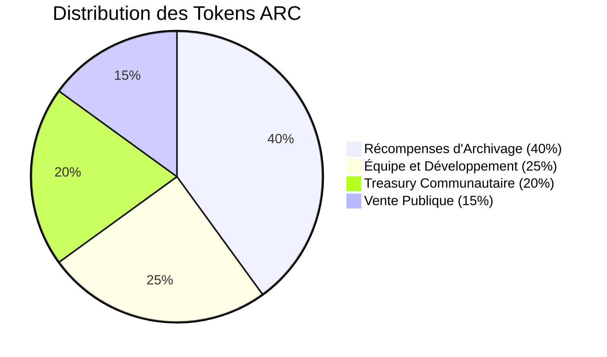

# Guide Économique ArchiveChain

## Table des Matières

- [Vue d'Ensemble](#vue-densemble)
- [Token ARC](#token-arc)
- [Distribution Initiale](#distribution-initiale)
- [Système de Récompenses](#système-de-récompenses)
- [Mécanismes Déflationnistes](#mécanismes-déflationnistes)
- [Staking et Gouvernance](#staking-et-gouvernance)
- [Treasury Communautaire](#treasury-communautaire)
- [Métriques Économiques](#métriques-économiques)
- [Calculateurs](#calculateurs)
- [Stratégies d'Investissement](#stratégies-dinvestissement)
- [FAQ Économique](#faq-économique)

## Vue d'Ensemble

L'économie d'ArchiveChain est conçue pour **inciter la préservation du patrimoine numérique mondial** tout en assurant la **durabilité économique à long terme**. Le système combine des mécanismes d'incitation robustes avec des forces déflationnistes pour créer un écosystème économique équilibré.

### Principes Fondamentaux

🎯 **Incentivization** - Récompenser la qualité et la durée de conservation  
🔥 **Déflationnisme** - Mécanismes automatiques de réduction de l'offre  
🏛️ **Gouvernance** - Contrôle communautaire décentralisé  
📈 **Durabilité** - Modèle économique pérenne  

### Métriques Clés (Live)

| Métrique | Valeur Actuelle | Tendance 30j |
|----------|-----------------|--------------|
| **Supply Totale** | 100,000,000,000 ARC | → |
| **Supply Circulante** | 15,500,000,000 ARC | ↗️ +2.1% |
| **Tokens Stakés** | 8,750,000,000 ARC | ↗️ +5.3% |
| **Taux de Staking** | 56.45% | ↗️ +1.2% |
| **APY Moyen** | 8.2% | ↘️ -0.3% |
| **Tokens Brûlés (Total)** | 125,000,000 ARC | ↗️ +8.7% |
| **Trésorerie** | 19,875,000,000 ARC | ↘️ -0.5% |

*Dernière mise à jour: temps réel via API*

## Token ARC

### Spécifications Techniques

```yaml
Nom: ArchiveChain Token
Symbole: ARC
Standard: Native (ERC-20 compatible)
Décimales: 18
Supply Maximum: 100,000,000,000 ARC (100 milliards)
Type: Utility Token avec Governance
```

### Utilités du Token

#### 1. Paiement des Services
- **Archivage** : Frais de création et stockage
- **Recherche** : Requêtes avancées et API
- **Réplication** : Services de réplication premium
- **Priorité** : Traitement prioritaire des archives

#### 2. Incitations Économiques
- **Récompenses d'archivage** : 100-500 ARC par archive
- **Récompenses de stockage** : 10-50 ARC/mois par TB
- **Récompenses de bande passante** : 1-5 ARC/GB transféré
- **Bonus de découverte** : 25-100 ARC pour contenu rare

#### 3. Gouvernance Décentralisée
- **Propositions** : Minimum 1M ARC pour proposer
- **Votes** : Poids basé sur les tokens stakés
- **Veto** : Mécanisme de protection minoritaire
- **Treasury** : Allocation des fonds communautaires

#### 4. Sécurisation du Réseau
- **Validation** : Stake minimum 10M ARC
- **Slashing** : Pénalités pour mauvais comportement
- **Sécurité économique** : Coût d'attaque élevé

## Distribution Initiale

### Allocation des 100 Milliards ARC



#### 1. Récompenses d'Archivage (40B ARC)
**Distribution sur 10 ans avec décroissance progressive**

| Année | Allocation Annuelle | Taux de Décroissance |
|-------|-------------------|---------------------|
| **An 1** | 6,000,000,000 ARC | - |
| **An 2** | 5,400,000,000 ARC | -10% |
| **An 3** | 4,860,000,000 ARC | -10% |
| **An 4** | 4,374,000,000 ARC | -10% |
| **An 5** | 3,936,600,000 ARC | -10% |
| **...** | ... | -10% |
| **An 10** | 2,287,678,574 ARC | -10% |

#### 2. Équipe et Développement (25B ARC)
**Vesting linéaire sur 4 ans avec cliff de 1 an**

```yaml
Cliff Period: 12 mois (0% released)
Vesting Period: 48 mois total
Release Schedule:
  - Mois 1-12: 0 ARC (cliff)
  - Mois 13-48: 694,444,444 ARC/mois (linear vesting)
  
Breakdown:
  - Core Team (15B): Leadership et développeurs principaux
  - Advisors (5B): Conseillers stratégiques et techniques
  - Reserve Team (5B): Futurs recrutements et acquisitions
```

#### 3. Treasury Communautaire (20B ARC)
**Gestion décentralisée via DAO**

```yaml
Allocation Initiale: 20,000,000,000 ARC
Utilisation:
  - Development Grants: 40% (8B ARC)
  - Marketing & Partnerships: 20% (4B ARC)
  - Research & Innovation: 20% (4B ARC)
  - Emergency Reserve: 10% (2B ARC)
  - Liquidity Mining: 10% (2B ARC)

Governance:
  - Minimum Stake: 1,000,000 ARC pour voter
  - Quorum: 15% des tokens stakés
  - Seuil d'approbation: 60%
  - Période de vote: 14 jours
```

#### 4. Vente Publique (15B ARC)
**Distribution immédiate aux early adopters**

```yaml
Total: 15,000,000,000 ARC
Tranches:
  - Seed Round: 3B ARC ($0.001/ARC) - Investisseurs institutionnels
  - Private Round: 5B ARC ($0.002/ARC) - Investisseurs privés
  - Public Sale: 7B ARC ($0.005/ARC) - Communauté publique

Lockup Periods:
  - Seed: 18 mois avec vesting linéaire
  - Private: 12 mois avec vesting linéaire
  - Public: Immédiat (50%) + 6 mois (50%)
```

## Système de Récompenses

### Types de Récompenses

#### 1. Archivage Initial

**Formule de Calcul:**
```
Récompense = Base_Reward × Quality_Multiplier × Rarity_Bonus × Size_Factor
```

**Composantes:**
- **Base Reward** : 100 ARC (standard)
- **Quality Multiplier** : 1x à 5x selon la qualité
- **Rarity Bonus** : +100 ARC pour contenu rare/unique
- **Size Factor** : Facteur basé sur la taille (0.5x à 2x)

**Exemples Concrets:**
```yaml
Page Web Standard (1MB):
  Base: 100 ARC
  Quality: 1.5x (bonne qualité)
  Rarity: 0 ARC
  Size: 1x
  Total: 150 ARC

Document Gouvernemental Rare (50MB):
  Base: 100 ARC
  Quality: 3x (excellente qualité)
  Rarity: 100 ARC
  Size: 1.5x
  Total: 550 ARC

Site Web Complet (500MB):
  Base: 100 ARC
  Quality: 2x (très bonne qualité)
  Rarity: 50 ARC (contenu semi-rare)
  Size: 2x
  Total: 450 ARC
```

#### 2. Stockage Continu

**Récompenses Mensuelles par TB Stocké:**
```yaml
Niveau Base: 25 ARC/TB/mois

Multiplicateurs:
  Performance Réseau:
    - >99.9% uptime: 2x
    - 99-99.9% uptime: 1.5x
    - 95-99% uptime: 1x
    - <95% uptime: 0.5x
  
  Durée de Stockage:
    - >2 ans: 2x bonus
    - >1 an: 1.5x bonus
    - >6 mois: 1.2x bonus
    - <6 mois: 1x

Exemples:
  Nœud Standard (10TB, 99.5% uptime, 8 mois):
    25 × 10 × 1x × 1.2x = 300 ARC/mois
  
  Nœud Premium (50TB, 99.95% uptime, 2+ ans):
    25 × 50 × 2x × 2x = 5,000 ARC/mois
```

#### 3. Bande Passante et Relais

**Récompenses par GB Transféré:**
```yaml
Base Rate: 2 ARC/GB

Multiplicateurs par Qualité de Service:
  - Latence <50ms: 1.5x
  - Latence 50-100ms: 1.2x
  - Latence 100-200ms: 1x
  - Latence >200ms: 0.8x

Multiplicateurs par Volume:
  - >1TB/jour: 1.3x
  - >100GB/jour: 1.1x
  - <100GB/jour: 1x

Exemple (Nœud Relay):
  Volume: 500GB/jour
  Latence moyenne: 45ms
  Récompense: 500 × 2 × 1.5 × 1.1 = 1,650 ARC/jour
```

#### 4. Découverte et Curation

**Bonus pour la Découverte de Contenu Précieux:**
```yaml
Algorithme de Rareté:
  - Contenu unique (score >0.95): 100 ARC
  - Contenu rare (score 0.8-0.95): 50 ARC
  - Contenu intéressant (score 0.6-0.8): 25 ARC

Facteurs de Rareté:
  - Âge du domaine
  - Fréquence de mise à jour
  - Références externes
  - Valeur historique
  - Difficulté d'accès

Bonus Communautaire:
  - Votes positifs de la communauté: +10-50 ARC
  - Utilisation fréquente: +20 ARC/mois
  - Citations académiques: +100 ARC par citation
```

### Optimisation des Récompenses

#### Stratégies pour Maximiser les Gains

**1. Archiveurs Spécialisés**
```yaml
Focus: Contenu rare et de qualité
Strategy:
  - Surveiller les sites gouvernementaux
  - Archiver pendant les événements importants
  - Développer des crawlers intelligents
  - Collaborer avec institutions académiques

ROI Potentiel: 500-2000 ARC/jour
Investment: Temps et expertise technique
```

**2. Opérateurs de Stockage**
```yaml
Focus: Infrastructure de stockage fiable
Strategy:
  - Investir dans hardware de qualité
  - Optimiser l'uptime (>99.9%)
  - Diversifier géographiquement
  - Maintenir long terme (>2 ans)

ROI Potentiel: 100-500 ARC/TB/mois
Investment: Hardware et maintenance
```

**3. Fournisseurs de Bande Passante**
```yaml
Focus: Connectivité et performance réseau
Strategy:
  - Déployer près des centres urbains
  - Optimiser la latence réseau
  - Augmenter la capacité
  - Monitoring 24/7

ROI Potentiel: 1000-5000 ARC/jour
Investment: Infrastructure réseau
```

## Mécanismes Déflationnistes

### 1. Burning Automatique des Frais

**10% de tous les frais sont brûlés automatiquement**

```yaml
Sources de Frais:
  - Transactions d'archivage: 1-10 ARC par transaction
  - Frais de recherche premium: 0.1-1 ARC par requête
  - Services API: 0.01-0.1 ARC par appel
  - Transfers de tokens: 0.1% du montant

Calcul du Burning:
  Total Fees Collected: 10,000 ARC/jour (exemple)
  Burned Amount: 1,000 ARC/jour
  Annual Burn Rate: ~365,000 ARC/an

Impact sur l'Offre:
  - Réduction permanente de la supply
  - Pression déflationniste constante
  - Appréciation potentielle de la valeur
```

### 2. Quality Staking avec Slashing

**Stakes Requis par Niveau de Qualité:**
```yaml
Quality Levels:
  Basic (Quality Score 60-70%):
    Stake Required: 10,000 ARC
    Slashing Risk: 5%
    
  Standard (Quality Score 70-80%):
    Stake Required: 50,000 ARC
    Slashing Risk: 10%
    
  Premium (Quality Score 80-90%):
    Stake Required: 200,000 ARC
    Slashing Risk: 15%
    
  Exceptional (Quality Score 90%+):
    Stake Required: 1,000,000 ARC
    Slashing Risk: 20%

Slashing Triggers:
  - Quality score < threshold for 30 days
  - Repeated downtime > 24h
  - Malicious behavior detection
  - False metadata reporting
```

**Exemple de Slashing:**
```yaml
Scenario: Premium node avec quality score de 75% (sous le seuil 80%)
Stake: 200,000 ARC
Slashing Rate: 15%
Amount Slashed: 30,000 ARC
Distribution:
  - 50% burned (15,000 ARC): Réduction de supply
  - 30% to treasury (9,000 ARC): Fonds communautaires
  - 20% to reporters (6,000 ARC): Incitation au monitoring
```

### 3. Mécanismes de Verrouillage Long Terme

**Bonus et Multiplicateurs par Durée de Lock:**
```yaml
Lock Periods & Multipliers:
  6 mois: 1.2x rewards
  1 an: 1.5x rewards
  2 ans: 2.0x rewards
  5 ans: 3.0x rewards

Tokens Locked Impact:
  - Réduction de l'offre circulante
  - Stabilité des prix
  - Engagement long terme
  - Sécurité du réseau

Current Stats:
  - 6 mois locks: 2.1B ARC (24%)
  - 1 an locks: 3.8B ARC (43%)
  - 2+ ans locks: 2.9B ARC (33%)
  - Total locked: 8.8B ARC (56.7% du circulant)
```

## Staking et Gouvernance

### Mécanismes de Staking

#### 1. Staking pour la Gouvernance

**Exigences Minimales:**
```yaml
Voting Rights:
  Minimum Stake: 1,000,000 ARC
  Lock Period: 30 jours minimum
  Max Lock: 5 ans (3x voting power)

Voting Power Calculation:
  Base Power = Staked Amount
  Time Multiplier = 1 + (Lock Months / 60) × 2
  Final Power = Base Power × Time Multiplier

Exemples:
  1M ARC, 30 jours: 1,000,000 votes
  1M ARC, 1 an: 1,400,000 votes
  1M ARC, 5 ans: 3,000,000 votes
```

#### 2. Staking pour la Validation

**Nœuds Validateurs:**
```yaml
Minimum Stake: 10,000,000 ARC
Lock Period: 90 jours minimum
Commission Range: 0-20%
Slashing Risk: 5-30%

Validator Rewards:
  Base APY: 8-12%
  Performance Bonus: jusqu'à +5%
  Commission Earnings: 0-20% des récompenses déléguées

Delegation:
  Minimum: 1,000 ARC
  Commission: 5-20% (variable par validateur)
  Unstaking Period: 21 jours
```

### Processus de Gouvernance

#### 1. Types de Propositions

```yaml
Parameter Changes:
  - Récompenses d'archivage
  - Fees de transaction
  - Taux de slashing
  - Durées de lock

Protocol Upgrades:
  - Nouvelles fonctionnalités
  - Optimisations de performance
  - Corrections de sécurité

Treasury Spending:
  - Grants de développement
  - Partenariats marketing
  - Recherche et innovation

Emergency Actions:
  - Pause du réseau
  - Corrections critiques
  - Intervention d'urgence
```

#### 2. Processus de Vote

**Phases du Processus:**
```yaml
1. Proposition (48h):
   - Dépôt: 100,000 ARC
   - Révision communautaire
   - Amendements possibles

2. Vote (14 jours):
   - Quorum: 15% des tokens stakés
   - Seuil: 60% pour approbation
   - Veto: 33% peut bloquer

3. Implémentation (7 jours):
   - Délai de grâce
   - Préparation technique
   - Communication

4. Exécution:
   - Mise en œuvre automatique
   - Monitoring des effets
   - Rapport post-implémentation
```

**Exemple de Proposition Récente:**
```yaml
Proposition #15: "Augmentation des Récompenses d'Archivage"
Description: Augmenter les récompenses de base de 100 à 120 ARC
Proposeur: ArchiveDAO Foundation
Stake Requis: 1,000,000 ARC ✓
Votes Pour: 45,230,000 ARC (68.2%)
Votes Contre: 21,120,000 ARC (31.8%)
Quorum: 66,350,000 ARC (22.1%) ✓
Statut: ADOPTÉ ✓
Implémentation: 25 juillet 2025
```

### Délégation et Pools de Staking

#### Pools Publics Recommandés

| Pool | Commission | TVL | APY | Uptime |
|------|------------|-----|-----|--------|
| **ArchiveStake Pro** | 5% | 2.1B ARC | 11.2% | 99.98% |
| **Heritage Pool** | 7% | 1.8B ARC | 10.8% | 99.95% |
| **Digital Preserve** | 10% | 1.2B ARC | 10.1% | 99.92% |
| **Community Vault** | 3% | 890M ARC | 11.5% | 99.89% |
| **Academic Alliance** | 8% | 650M ARC | 10.5% | 99.94% |

#### Comment Choisir un Pool

**Critères d'Évaluation:**
```yaml
1. Commission Rate (3-10% optimal)
2. Uptime History (>99.9% required)
3. Total Value Locked (higher = more stable)
4. Community Reputation
5. Geographic Distribution
6. Hardware Specifications
7. Team Experience
```

## Treasury Communautaire

### Gestion des Fonds (20B ARC)

#### Allocation Actuelle

```yaml
Total Treasury: 19,875,000,000 ARC
Allocated: 125,000,000 ARC (0.6%)
Available: 19,750,000,000 ARC (99.4%)

Categories:
  Development Grants:
    Budget: 8,000,000,000 ARC
    Spent: 45,000,000 ARC
    Active Projects: 15
    
  Marketing & Partnerships:
    Budget: 4,000,000,000 ARC
    Spent: 12,000,000 ARC
    Active Campaigns: 8
    
  Research & Innovation:
    Budget: 4,000,000,000 ARC
    Spent: 35,000,000 ARC
    Active Grants: 12
    
  Emergency Reserve:
    Budget: 2,000,000,000 ARC
    Untouched: 2,000,000,000 ARC
    
  Liquidity Mining:
    Budget: 2,000,000,000 ARC
    Distributed: 33,000,000 ARC
    Active Programs: 6
```

#### Processus de Financement

**1. Soumission de Proposition**
```yaml
Eligibility:
  - Minimum stake: 100,000 ARC
  - Community support: 5+ endorsements
  - Detailed budget breakdown
  - Clear milestones and timeline

Required Documents:
  - Project proposal (max 10 pages)
  - Technical specifications
  - Team credentials
  - Budget justification
  - Risk assessment
  - Success metrics
```

**2. Évaluation par Comité**
```yaml
Technical Committee (7 members):
  - Blockchain experts
  - Archive specialists
  - Security auditors
  - Academic representatives

Evaluation Criteria:
  - Technical feasibility (25%)
  - Impact potential (25%)
  - Team competence (20%)
  - Budget reasonableness (15%)
  - Timeline realism (15%)

Scoring: 1-10 scale, minimum 7.0 to proceed
```

**3. Vote Communautaire**
```yaml
Voting Period: 14 days
Participation Requirements:
  - Minimum stake: 1,000,000 ARC
  - Must be locked for >30 days

Decision Thresholds:
  - <1M ARC requested: 50% approval
  - 1-10M ARC: 60% approval
  - 10-100M ARC: 70% approval
  - >100M ARC: 80% approval

Quorum Requirements:
  - Small grants (<1M): 10%
  - Medium grants (1-10M): 15%
  - Large grants (>10M): 25%
```

#### Projets Financés Récents

**Développement:**
```yaml
"IPFS Integration Layer" - 2.5M ARC
Status: In Progress (70% complete)
Team: DistributedSystems Labs
Impact: Decentralized storage backbone

"Mobile Archive App" - 1.2M ARC
Status: Completed
Team: ArchiveMobile Inc
Impact: 50,000+ downloads, 4.8⭐ rating

"AI Content Classification" - 3.8M ARC
Status: Research Phase
Team: Stanford AI Lab
Impact: Automated content tagging
```

**Partenariats:**
```yaml
"Internet Archive Collaboration" - 5M ARC
Status: Active
Impact: 10M+ historical archives migrated

"University Consortium" - 2M ARC
Status: Expanding
Partners: 25 universities globally
Impact: Academic archive standardization
```

## Métriques Économiques

### Indicateurs de Santé Économique

#### 1. Token Velocity
```yaml
Current Velocity: 0.85 (optimal: 0.5-1.5)
Calculation: Trading Volume / Circulating Supply
Interpretation: Modérée, indicateur de spéculation raisonnable

Monthly Trend:
  Jan 2025: 0.92
  Feb 2025: 0.88
  Mar 2025: 0.85
  Trend: ↘️ Décroissant (positif pour HODLers)
```

#### 2. Staking Ratio
```yaml
Current Ratio: 56.45%
Calculation: Staked Supply / Circulating Supply
Benchmark: 40-70% (optimal security range)

Impact:
  - Network Security: HIGH ✅
  - Token Scarcity: MODERATE ✅
  - Governance Participation: GOOD ✅
```

#### 3. Treasury Utilization
```yaml
Current Rate: 0.63% annually
Calculation: Yearly Spending / Treasury Balance
Sustainability: 158 years at current rate

Efficiency Metrics:
  - ROI on Development: 340% (measured in network growth)
  - Marketing CAC: $12 per active user
  - Research Citations: 45 academic papers published
```

#### 4. Deflation Rate
```yaml
Current Annualized Rate: 0.37%
Sources:
  - Fee Burning: 0.25%
  - Slashing Events: 0.07%
  - Lost Keys (estimated): 0.05%

Long-term Projection:
  - Year 1: -0.37%
  - Year 5: -0.85%
  - Year 10: -1.2%
  - Terminal Rate: -2.5% (theoretical equilibrium)
```

### Dashboard en Temps Réel

#### Métriques Live (API)

```javascript
// Endpoint pour métriques économiques
GET https://api.archivechain.org/v1/economics/metrics

// Réponse JSON
{
  "timestamp": "2025-07-23T21:00:00Z",
  "supply": {
    "total": "100000000000000000000000000000",
    "circulating": "15500000000000000000000000000",
    "staked": "8750000000000000000000000000",
    "burned": "125000000000000000000000000"
  },
  "staking": {
    "ratio": 0.5645,
    "apy_average": 0.082,
    "validators": 156,
    "delegators": 12547
  },
  "treasury": {
    "balance": "19875000000000000000000000000",
    "allocated": "125000000000000000000000000",
    "utilization_rate": 0.0063
  },
  "deflation": {
    "annual_rate": -0.0037,
    "monthly_burn": "10416666666666666666666667",
    "sources": {
      "fees": 0.0025,
      "slashing": 0.0007,
      "lost_keys": 0.0005
    }
  }
}
```

## Calculateurs

### 1. Calculateur de Récompenses d'Archivage

```javascript
// Fonction de calcul des récompenses
function calculateArchiveReward(params) {
  const {
    baseReward = 100,      // ARC
    qualityScore,          // 0-100
    size,                  // bytes
    rarity,                // 0-100
    contentType
  } = params;
  
  // Quality multiplier (1x à 5x)
  const qualityMultiplier = 1 + (qualityScore / 100) * 4;
  
  // Size factor (0.5x à 2x)
  const sizeFactor = Math.min(2, Math.max(0.5, Math.log10(size) / 8));
  
  // Rarity bonus (0 à 100 ARC)
  const rarityBonus = (rarity / 100) * 100;
  
  // Content type bonus
  const contentBonus = {
    'government': 1.5,
    'academic': 1.3,
    'news': 1.2,
    'general': 1.0
  }[contentType] || 1.0;
  
  const totalReward = (baseReward * qualityMultiplier * sizeFactor * contentBonus) + rarityBonus;
  
  return {
    baseReward,
    qualityMultiplier,
    sizeFactor,
    rarityBonus,
    contentBonus,
    totalReward: Math.round(totalReward)
  };
}

// Exemple d'utilisation
const reward = calculateArchiveReward({
  qualityScore: 85,
  size: 50000000, // 50MB
  rarity: 75,
  contentType: 'academic'
});
console.log(reward); 
// Output: { totalReward: 487 ARC }
```

### 2. Calculateur de Staking ROI

```javascript
function calculateStakingROI(params) {
  const {
    stakedAmount,        // ARC
    lockPeriod,         // mois
    validatorCommission = 0.05, // 5%
    baseAPY = 0.08      // 8%
  } = params;
  
  // Time multiplier pour lock period
  const timeMultiplier = 1 + (lockPeriod / 60) * 2;
  
  // Effective APY
  const effectiveAPY = baseAPY * timeMultiplier * (1 - validatorCommission);
  
  // Calculs annuels
  const annualReward = stakedAmount * effectiveAPY;
  const monthlyReward = annualReward / 12;
  const dailyReward = annualReward / 365;
  
  return {
    effectiveAPY: effectiveAPY * 100, // en %
    annualReward,
    monthlyReward,
    dailyReward,
    totalAfterLock: stakedAmount + (annualReward * lockPeriod / 12)
  };
}

// Exemple
const stakingROI = calculateStakingROI({
  stakedAmount: 1000000, // 1M ARC
  lockPeriod: 24,        // 2 ans
  validatorCommission: 0.05
});
console.log(stakingROI);
// Output: { effectiveAPY: 22.8%, annualReward: 228,000 ARC }
```

### 3. Calculateur de Valeur de Portefeuille

```html
<!-- Widget HTML intégrable -->
<div id="portfolio-calculator">
  <h3>Calculateur de Portefeuille ARC</h3>
  
  <label>Tokens ARC détenus:</label>
  <input type="number" id="arcBalance" placeholder="1000000">
  
  <label>Tokens stakés (ARC):</label>
  <input type="number" id="arcStaked" placeholder="500000">
  
  <label>Période de lock (mois):</label>
  <select id="lockPeriod">
    <option value="0">Pas de lock</option>
    <option value="6">6 mois (+20%)</option>
    <option value="12">1 an (+50%)</option>
    <option value="24">2 ans (+100%)</option>
    <option value="60">5 ans (+200%)</option>
  </select>
  
  <button onclick="calculatePortfolio()">Calculer</button>
  
  <div id="results"></div>
</div>

<script>
function calculatePortfolio() {
  const balance = parseFloat(document.getElementById('arcBalance').value) || 0;
  const staked = parseFloat(document.getElementById('arcStaked').value) || 0;
  const lockPeriod = parseInt(document.getElementById('lockPeriod').value) || 0;
  
  // Current ARC price (mock - should fetch from API)
  const arcPrice = 0.0075; // $0.0075
  
  // Staking calculations
  const baseAPY = 0.08;
  const timeMultiplier = lockPeriod > 0 ? (1 + (lockPeriod / 60) * 2) : 1;
  const effectiveAPY = baseAPY * timeMultiplier;
  
  const totalValue = balance * arcPrice;
  const stakingRewards = staked * effectiveAPY;
  const monthlyRewards = stakingRewards / 12;
  
  document.getElementById('results').innerHTML = `
    <h4>Résultats</h4>
    <p><strong>Valeur totale:</strong> $${totalValue.toLocaleString()}</p>
    <p><strong>APY effectif:</strong> ${(effectiveAPY * 100).toFixed(1)}%</p>
    <p><strong>Récompenses annuelles:</strong> ${stakingRewards.toLocaleString()} ARC ($${(stakingRewards * arcPrice).toLocaleString()})</p>
    <p><strong>Revenus mensuels:</strong> ${monthlyRewards.toLocaleString()} ARC ($${(monthlyRewards * arcPrice).toLocaleString()})</p>
    ${lockPeriod > 0 ? `<p><strong>Bonus de lock:</strong> +${((timeMultiplier - 1) * 100).toFixed(0)}%</p>` : ''}
  `;
}
</script>
```

## Stratégies d'Investissement

### Profils d'Investisseurs

#### 1. Archiveur Actif
```yaml
Profil: Opérateur de nœud archive actif
Capital: 100,000 - 1,000,000 ARC
Stratégie:
  - 70% staking pour gouvernance
  - 20% operational reserves
  - 10% speculation/trading

ROI Target: 15-25% annuel
Risk: Modéré (slashing exposure)
Time Horizon: 2-5 ans

Optimisations:
  - Lock 2 ans pour bonus 100%
  - Choisir validateur low-commission
  - Participer activement à la gouvernance
  - Réinvestir rewards automatiquement
```

#### 2. Investisseur Passif
```yaml
Profil: Détenteur long terme
Capital: 10,000 - 100,000 ARC
Stratégie:
  - 90% staking long terme
  - 10% liquid pour opportunités

ROI Target: 8-15% annuel
Risk: Faible
Time Horizon: 5+ ans

Optimisations:
  - Lock maximum (5 ans) pour 3x voting power
  - DCA (Dollar Cost Averaging) mensuel
  - Pool staking haute réputation
  - Compound rewards automatiquement
```

#### 3. Trader/Spéculateur
```yaml
Profil: Trading actif et arbitrage
Capital: Variable
Stratégie:
  - 30% long term holding
  - 70% trading/arbitrage

ROI Target: 20-50% annuel (volatile)
Risk: Élevé
Time Horizon: 3 mois - 2 ans

Techniques:
  - Arbitrage inter-exchanges
  - Swing trading sur events
  - Yield farming nouveau pools
  - Governance event trading
```

### Stratégies Avancées

#### 1. Yield Farming Compound
```yaml
Strategy: Maximiser les rewards composés
Steps:
  1. Stake 80% en 2 ans lock
  2. Auto-compound rewards mensuels
  3. Claim et re-stake rewards
  4. Participer aux bonus pools

Expected APY: 12-18%
Complexity: Medium
Capital Required: 50,000+ ARC

Risks:
  - Smart contract risk
  - Validator slashing
  - Opportunity cost
```

#### 2. Arbitrage de Gouvernance
```yaml
Strategy: Profiter des événements de gouvernance
Approach:
  1. Analyser propositions en avance
  2. Accumuler avant votes importants
  3. Vendre volatilité post-annonce
  4. Réinvestir sur correction

Tools Needed:
  - Governance calendar
  - Vote tracking
  - Price alerts
  - News monitoring

Risk Level: High
Skill Required: Expert
```

#### 3. Multi-Pool Diversification
```yaml
Strategy: Répartir sur plusieurs validators
Benefits:
  - Reduced slashing risk
  - Access to different APYs
  - Geographic diversification
  - Governance influence spreading

Example Allocation:
  - 30% Top validator (5% commission)
  - 25% Academic pool (7% commission)
  - 25% Geographic diverse (6% commission)
  - 20% Community favorite (8% commission)

Expected APY: 10.2% weighted average
Risk Reduction: ~40% slashing exposure
```

## FAQ Économique

### Questions Générales

**Q: Combien de tokens ARC seront en circulation à terme ?**
A: Maximum 100 milliards ARC. Cependant, les mécanismes déflationnistes (burning, slashing, clés perdues) réduiront progressivement cette supply. Les projections indiquent une supply stabilisée autour de 75-80 milliards après 10 ans.

**Q: Comment le prix du token ARC est-il déterminé ?**
A: Le prix est déterminé par l'offre et la demande sur les marchés. Facteurs d'influence:
- Utilité du réseau (demande de services)
- Mécanismes déflationnistes (réduction offre)
- Adoption institutionnelle
- Sentiment général crypto
- Développements technologiques

**Q: Quelle est la différence entre staking et holding ?**
A: 
- **Holding**: Détention simple, pas de rewards
- **Staking**: Tokens lockés pour sécuriser le réseau, génère des rewards (8%+ APY)

### Staking et Récompenses

**Q: Quel est le minimum pour staker ?**
A: 1,000 ARC minimum via delegation. Pour opérer un validateur: 10,000,000 ARC.

**Q: Puis-je unstake à tout moment ?**
A: Dépend du type de staking:
- Delegation flexible: 21 jours d'attente
- Governance staking: Minimum 30 jours lock
- Long-term locks: Selon la période choisie (6 mois à 5 ans)

**Q: Que se passe-t-il si mon validateur est slashé ?**
A: Les délégateurs partagent les pertes proportionnellement. C'est pourquoi il faut choisir des validateurs réputés avec bon historique.

**Q: Comment sont calculées les récompenses de staking ?**
A: Formule de base: Stake × APY × Time Multiplier × (1 - Commission)
- APY de base: ~8%
- Time multiplier: 1x à 3x selon lock period
- Commission validateur: 0-20%

### Gouvernance

**Q: Combien faut-il pour voter ?**
A: Minimum 1,000,000 ARC stakés avec lock minimum 30 jours.

**Q: Comment fonctionne le pouvoir de vote ?**
A: Pouvoir = Tokens Stakés × Time Multiplier
- 30 jours: 1x
- 1 an: 1.4x  
- 5 ans: 3x

**Q: Que se passe si je ne vote pas ?**
A: Aucune pénalité, mais vous perdez l'opportunité d'influencer l'évolution du protocole.

### Treasury et Développement

**Q: Comment puis-je obtenir un grant de la treasury ?**
A: Processus en 3 étapes:
1. Soumission de proposition détaillée
2. Évaluation par comité technique
3. Vote communautaire (14 jours)

**Q: Quels types de projets sont financés ?**
A: 
- Développement core protocol
- Outils et applications
- Recherche académique
- Marketing et adoption
- Partenariats stratégiques

**Q: Quelle est la taille moyenne des grants ?**
A: 
- Petits projets: 10,000 - 100,000 ARC
- Projets moyens: 100,000 - 1,000,000 ARC
- Grands projets: 1,000,000 - 10,000,000 ARC
- Initiatives stratégiques: 10,000,000+ ARC

### Aspects Techniques

**Q: Comment vérifier mes récompenses ?**
A: Plusieurs méthodes:
- CLI: `archivechain-cli rewards balance`
- API: `GET /v1/rewards/address/{address}`
- Web dashboard: https://dashboard.archivechain.org
- Block explorer: https://explorer.archivechain.org

**Q: Les rewards sont-elles automatiques ?**
A: Oui, les rewards de staking sont distribuées automatiquement chaque époque (6 heures). Les rewards d'archivage sont créditées dès validation.

**Q: Comment optimiser mes taxes sur les rewards ?**
A: Consultez un expert fiscal, mais généralement:
- Staking rewards = revenus imposables
- Plus-values = lors de vente uniquement
- Hold >1 an = souvent taux réduit
- Varies by jurisdiction

---

*Dernière mise à jour: 23 juillet 2025*
*Les informations sont à titre éducatif uniquement et ne constituent pas des conseils financiers*