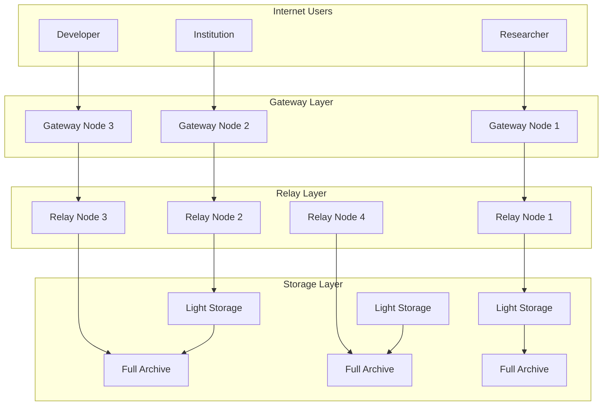

# Guide des Nœuds ArchiveChain

## Table des Matières

- [Vue d'Ensemble](#vue-densemble)
- [Types de Nœuds](#types-de-nœuds)
- [Configuration et Déploiement](#configuration-et-déploiement)
- [Monitoring et Maintenance](#monitoring-et-maintenance)
- [Optimisation des Performances](#optimisation-des-performances)
- [Sécurité et Bonnes Pratiques](#sécurité-et-bonnes-pratiques)
- [Troubleshooting](#troubleshooting)
- [ROI et Rentabilité](#roi-et-rentabilité)

## Vue d'Ensemble

ArchiveChain utilise une **architecture de nœuds distribués spécialisés** pour optimiser les performances, la scalabilité et l'efficacité économique. Chaque type de nœud a un rôle spécifique dans l'écosystème, permettant une participation adaptée aux ressources et objectifs de chaque opérateur.

### Architecture du Réseau



### Statistiques du Réseau (Live)

| Métrique | Total | En Ligne | Pourcentage |
|----------|-------|----------|-------------|
| **Full Archive** | 156 | 152 | 97.4% |
| **Light Storage** | 892 | 867 | 97.2% |
| **Relay** | 98 | 96 | 98.0% |
| **Gateway** | 52 | 51 | 98.1% |
| **Total** | 1,198 | 1,166 | 97.3% |

## Types de Nœuds

### 1. Full Archive Nodes 🏦

#### Profil et Spécifications
```yaml
Target Audience: Institutions, entreprises, investisseurs sérieux
Investment Range: $50,000 - $500,000+
ROI Target: 15-25% annuel

Hardware Requirements:
  CPU: 32+ cores (Intel Xeon ou AMD EPYC)
  RAM: 128+ GB ECC
  Storage: 20+ TB NVMe SSD (RAID 1/10)
  Network: 10 Gbps dédié
  Power: Redondant (2 PSU)
  Cooling: Datacenter grade

Software Stack:
  OS: Ubuntu 22.04 LTS Server
  Storage: ZFS avec compression
  Backup: Automated snapshots
  Monitoring: Prometheus + Grafana
```

#### Responsabilités
- **Stockage complet** de toutes les archives du réseau
- **Validation** cryptographique de l'intégrité des données
- **Participation pleine** au consensus Proof of Archive
- **Synchronisation** complète de la blockchain
- **Sauvegarde** et récupération automatisées

#### Configuration Exemple
```toml
# config/full_archive.toml
[node]
type = "full_archive"
identity_key = "/data/keys/node_identity.key"
data_dir = "/data/archivechain"
log_level = "info"

[storage]
capacity = "50TB"
replication_factor = 10
compression = true
deduplication = true
backup_enabled = true
backup_schedule = "0 2 * * *"  # Daily at 2 AM

[consensus]
participate = true
weight = 1.0
validator_key = "/data/keys/validator.key"
min_stake = "10000000000000000000000000"  # 10M ARC

[network]
listen_addr = "0.0.0.0:9090"
max_peers = 200
bandwidth_limit = "1GB/s"

[performance]
max_concurrent_archives = 100
indexing_threads = 16
compression_level = 6
cache_size = "32GB"
```

#### Récompenses Économiques
```yaml
Archive Rewards:
  Base: 100-500 ARC par archive
  Quality Bonus: jusqu'à 5x
  Rarity Bonus: +100 ARC
  
Storage Rewards:
  Base: 25 ARC/TB/mois
  Performance: jusqu'à 2x
  Long-term: jusqu'à 2x
  
Example (50TB, 99.9% uptime, 2+ ans):
  Monthly: 25 × 50 × 2 × 2 = 5,000 ARC
  Annual: 60,000 ARC (~$450 à $0.0075/ARC)
```

### 2. Light Storage Nodes 💡

#### Profil et Spécifications
```yaml
Target Audience: Organisations spécialisées, PME, développeurs
Investment Range: $5,000 - $50,000
ROI Target: 12-20% annuel

Hardware Requirements:
  CPU: 8+ cores
  RAM: 32+ GB
  Storage: 2-10 TB SSD
  Network: 1 Gbps
  Uptime: 99%+

Specialization Options:
  - Domain-based (.gov, .edu, .org)
  - Geographic (Europe, Asia, Americas)
  - Content-type (PDF, HTML, video)
  - Temporal (recent vs historical)
```

#### Types de Spécialisation

**A. Spécialisation par Domaine**
```toml
[specialization]
type = "domain"
patterns = [
  "*.gov",
  "*.edu", 
  "*.mil",
  "*.org"
]
priority_keywords = ["government", "education", "research"]
content_filters = ["en", "fr", "de"]
```

**B. Spécialisation Géographique**
```toml
[specialization]
type = "geographic"
regions = ["europe-west", "europe-central"]
languages = ["fr", "de", "en", "it", "es"]
timezone_optimization = true
local_mirror_priority = true
```

**C. Spécialisation par Type de Contenu**
```toml
[specialization]
type = "content_type"
mime_types = [
  "application/pdf",
  "text/html",
  "application/epub+zip"
]
size_range = { min = "1KB", max = "100MB" }
quality_threshold = 80
```

#### Récompenses Économiques
```yaml
Archive Rewards:
  Specialized Content: 150-350 ARC
  General Content: 100-250 ARC
  Expertise Bonus: +20%

Storage Rewards:
  Base: 20 ARC/TB/mois
  Specialization Bonus: 1.5x
  
Example (5TB spécialisé, 99% uptime):
  Monthly: 20 × 5 × 1.5 = 150 ARC
  Annual: 1,800 ARC + archive rewards
```

### 3. Relay Nodes 🌐

#### Profil et Spécifications
```yaml
Target Audience: ISPs, CDN providers, infrastructure specialists
Investment Range: $10,000 - $100,000
ROI Target: 10-18% annuel

Hardware Requirements:
  CPU: 16+ cores (optimisé réseau)
  RAM: 64+ GB
  Storage: 500 GB SSD (cache)
  Network: 10+ Gbps
  Connexions: 1000+ simultanées
  Latence: <50ms moyenne
```

#### Responsabilités
- **Routage optimisé** des messages P2P
- **Découverte** automatique de pairs
- **Load balancing** du trafic réseau
- **Cache intelligent** des données fréquemment accédées
- **Monitoring** de la topologie réseau

#### Configuration Avancée
```toml
[relay]
max_connections = 2000
bandwidth_limit = "5GB/s"
cache_size = "100GB"
routing_table_size = 50000
discovery_interval = "15s"

[performance]
prefetch_enabled = true
compression_on_fly = true
adaptive_routing = true
geo_optimization = true

[cache]
strategy = "lru_adaptive"
hot_data_retention = "24h"
popular_content_boost = 2.0
geographic_affinity = true

[monitoring]
latency_tracking = true
bandwidth_monitoring = true
peer_health_checks = "30s"
route_optimization = "300s"
```

#### Récompenses Économiques
```yaml
Bandwidth Rewards:
  Base: 2 ARC/GB transféré
  Latency Bonus:
    <50ms: 1.5x
    <25ms: 2x
  Volume Bonus:
    >1TB/jour: 1.3x
    >10TB/jour: 1.5x

Example (5TB/jour, <30ms latency):
  Daily: 5000 × 2 × 2 × 1.3 = 26,000 ARC
  Monthly: ~780,000 ARC
  Annual: ~9.4M ARC
```

### 4. Gateway Nodes 🚪

#### Profil et Spécifications
```yaml
Target Audience: Services publics, entreprises tech, startups
Investment Range: $20,000 - $200,000
ROI Target: 15-30% annuel

Hardware Requirements:
  CPU: 32+ cores
  RAM: 128+ GB
  Storage: 2+ TB SSD
  Network: 10+ Gbps
  Load Balancer: Requis
  DDoS Protection: Recommandé
```

#### Responsabilités
- **APIs publiques** (REST, GraphQL, WebSocket, gRPC)
- **Authentification** et autorisation
- **Rate limiting** et sécurité
- **Cache** multicouche intelligent
- **Documentation** et support développeur

#### Configuration Multi-API
```toml
[api]
enabled = true

[api.rest]
port = 8080
max_connections = 10000
rate_limit = 2000
cors_enabled = true
swagger_ui = true

[api.graphql]
port = 8081
max_query_depth = 15
query_complexity_limit = 1000
subscription_enabled = true

[api.websocket]
port = 8082
max_connections = 5000
ping_interval = "30s"
compression = true

[api.grpc]
port = 9091
max_connections = 1000
reflection_enabled = true

[security]
jwt_secret_file = "/data/keys/jwt_secret"
rate_limit_redis = "redis://localhost:6379"
ddos_protection = true
waf_enabled = true

[cache]
layers = ["memory", "redis", "disk"]
memory_size = "16GB"
redis_url = "redis://localhost:6379"
disk_cache = "/data/cache"
ttl_default = "1h"
```

#### Récompenses Économiques
```yaml
Service Fees:
  API Calls: 0.01-0.1 ARC per call
  Premium Features: 1-10 ARC per request
  Enterprise Support: Contract-based

Example Revenue (1M API calls/day):
  Standard Calls (80%): 800,000 × 0.01 = 8,000 ARC
  Premium Calls (20%): 200,000 × 0.1 = 20,000 ARC
  Daily Total: 28,000 ARC
  Monthly: ~840,000 ARC
  Annual: ~10M ARC
```

## Configuration et Déploiement

### Déploiement Automatisé avec Docker

#### Docker Compose pour Full Archive
```yaml
# docker-compose.full-archive.yml
version: '3.8'

services:
  archivechain-full:
    image: archivechain/node:latest
    container_name: archivechain-full-archive
    restart: unless-stopped
    
    ports:
      - "9090:9090"  # P2P
      - "9999:9999"  # Metrics
    
    volumes:
      - ./data:/data
      - ./config:/config
      - ./logs:/logs
      - ./backups:/backups
    
    environment:
      - ARCHIVECHAIN_CONFIG=/config/full_archive.toml
      - RUST_LOG=archivechain=info
      - ARCHIVECHAIN_DATA_DIR=/data
    
    command: >
      archivechain-node start
      --config /config/full_archive.toml
      --log-file /logs/node.log
    
    deploy:
      resources:
        limits:
          memory: 128G
          cpus: '32'
        reservations:
          memory: 64G
          cpus: '16'
    
    healthcheck:
      test: ["CMD", "archivechain-cli", "node", "health"]
      interval: 30s
      timeout: 10s
      retries: 3
      start_period: 60s

  prometheus:
    image: prom/prometheus:latest
    ports:
      - "9090:9090"
    volumes:
      - ./monitoring/prometheus.yml:/etc/prometheus/prometheus.yml
      - prometheus_data:/prometheus
    command:
      - '--config.file=/etc/prometheus/prometheus.yml'
      - '--storage.tsdb.path=/prometheus'
      - '--web.console.libraries=/etc/prometheus/console_libraries'
      - '--web.console.templates=/etc/prometheus/consoles'

  grafana:
    image: grafana/grafana:latest
    ports:
      - "3000:3000"
    volumes:
      - grafana_data:/var/lib/grafana
      - ./monitoring/dashboards:/etc/grafana/provisioning/dashboards
    environment:
      - GF_SECURITY_ADMIN_PASSWORD=admin123

volumes:
  prometheus_data:
  grafana_data:
```

#### Terraform pour AWS Deployment
```hcl
# terraform/full-archive-node.tf
resource "aws_instance" "full_archive_node" {
  count         = var.node_count
  ami           = data.aws_ami.ubuntu.id
  instance_type = "r5.8xlarge"  # 32 vCPU, 256 GB RAM
  
  key_name               = aws_key_pair.archivechain.key_name
  vpc_security_group_ids = [aws_security_group.archivechain_node.id]
  subnet_id             = aws_subnet.private[count.index % length(aws_subnet.private)].id
  
  ebs_block_device {
    device_name = "/dev/sdf"
    volume_type = "gp3"
    volume_size = 20480  # 20 TB
    iops        = 16000
    throughput  = 1000
    encrypted   = true
  }
  
  user_data = templatefile("${path.module}/user_data.sh", {
    node_type = "full_archive"
    config    = file("${path.module}/configs/full_archive.toml")
  })
  
  tags = {
    Name = "archivechain-full-archive-${count.index + 1}"
    Type = "FullArchive"
    Environment = var.environment
  }
}

resource "aws_eip" "node_eip" {
  count    = var.node_count
  instance = aws_instance.full_archive_node[count.index].id
  domain   = "vpc"
  
  tags = {
    Name = "archivechain-full-archive-eip-${count.index + 1}"
  }
}

# Auto Scaling Group pour High Availability
resource "aws_autoscaling_group" "archivechain_nodes" {
  name                = "archivechain-full-archive-asg"
  vpc_zone_identifier = aws_subnet.private[*].id
  target_group_arns   = [aws_lb_target_group.archivechain.arn]
  health_check_type   = "ELB"
  health_check_grace_period = 300

  min_size         = 3
  max_size         = 10
  desired_capacity = 5

  launch_template {
    id      = aws_launch_template.archivechain_node.id
    version = "$Latest"
  }

  tag {
    key                 = "Name"
    value               = "archivechain-full-archive-asg"
    propagate_at_launch = false
  }
}
```

### Déploiement sur Kubernetes

```yaml
# k8s/full-archive-deployment.yaml
apiVersion: apps/v1
kind: StatefulSet
metadata:
  name: archivechain-full-archive
  namespace: archivechain
spec:
  serviceName: archivechain-full-archive
  replicas: 3
  selector:
    matchLabels:
      app: archivechain-full-archive
  template:
    metadata:
      labels:
        app: archivechain-full-archive
    spec:
      containers:
      - name: archivechain-node
        image: archivechain/node:v1.0.0
        ports:
        - containerPort: 9090
          name: p2p
        - containerPort: 9999
          name: metrics
        
        env:
        - name: ARCHIVECHAIN_CONFIG
          value: /config/full_archive.toml
        - name: RUST_LOG
          value: archivechain=info
        
        volumeMounts:
        - name: config
          mountPath: /config
        - name: data
          mountPath: /data
        - name: keys
          mountPath: /keys
          readOnly: true
        
        resources:
          requests:
            memory: 64Gi
            cpu: 16
          limits:
            memory: 128Gi
            cpu: 32
        
        livenessProbe:
          exec:
            command:
            - archivechain-cli
            - node
            - health
          initialDelaySeconds: 60
          periodSeconds: 30
        
        readinessProbe:
          exec:
            command:
            - archivechain-cli
            - node
            - ready
          initialDelaySeconds: 30
          periodSeconds: 10

      volumes:
      - name: config
        configMap:
          name: archivechain-config
      - name: keys
        secret:
          secretName: archivechain-keys
          defaultMode: 0600

  volumeClaimTemplates:
  - metadata:
      name: data
    spec:
      accessModes: ["ReadWriteOnce"]
      storageClassName: fast-ssd
      resources:
        requests:
          storage: 20Ti
```

## Monitoring et Maintenance

### Dashboard de Monitoring Complet

#### Métriques Clés par Type de Nœud

**Full Archive Nodes:**
```yaml
Critiques:
  - Storage utilization (>80% = warning)
  - Memory usage (>90% = alert)
  - Network connectivity (>5 disconnections/hour)
  - Archive processing time (>10min average)

Performance:
  - Archives processed/hour
  - Storage I/O operations
  - Network throughput
  - Consensus participation rate

Économiques:
  - Daily ARC rewards
  - ROI calculation
  - Cost per TB stored
  - Power consumption
```

**Light Storage Nodes:**
```yaml
Critiques:
  - Specialization accuracy (>95% required)
  - Cache hit ratio (>70% optimal)
  - Network latency (<100ms)
  - Uptime (>99% required)

Performance:
  - Content filtering efficiency
  - Specialized archives ratio
  - Response time
  - Bandwidth utilization
```

#### Prometheus Configuration
```yaml
# monitoring/prometheus.yml
global:
  scrape_interval: 15s
  evaluation_interval: 15s

rule_files:
  - "archivechain_alerts.yml"

scrape_configs:
  - job_name: 'archivechain-nodes'
    static_configs:
      - targets: 
        - 'full-archive-1:9999'
        - 'full-archive-2:9999'
        - 'light-storage-1:9999'
        - 'relay-1:9999'
        - 'gateway-1:9999'
    scrape_interval: 30s
    metrics_path: /metrics

  - job_name: 'system'
    static_configs:
      - targets: ['node-exporter:9100']

alerting:
  alertmanagers:
    - static_configs:
        - targets: ['alertmanager:9093']
```

#### Alertes Critiques
```yaml
# monitoring/archivechain_alerts.yml
groups:
- name: archivechain_critical
  rules:
  - alert: NodeDown
    expr: up{job="archivechain-nodes"} == 0
    for: 1m
    labels:
      severity: critical
    annotations:
      summary: "ArchiveChain node {{ $labels.instance }} is down"
      description: "Node has been down for more than 1 minute"

  - alert: HighStorageUsage
    expr: (archivechain_storage_used / archivechain_storage_total) > 0.85
    for: 5m
    labels:
      severity: warning
    annotations:
      summary: "High storage usage on {{ $labels.instance }}"
      description: "Storage usage is {{ $value | humanizePercentage }}"

  - alert: ConsensusParticipationLow
    expr: archivechain_consensus_participation_rate < 0.8
    for: 10m
    labels:
      severity: critical
    annotations:
      summary: "Low consensus participation on {{ $labels.instance }}"
      description: "Consensus participation rate is {{ $value | humanizePercentage }}"
```

### Scripts de Maintenance Automatisée

#### Script de Health Check
```bash
#!/bin/bash
# scripts/health_check.sh

NODE_TYPE="${1:-full_archive}"
LOG_FILE="/var/log/archivechain/health_check.log"
ALERT_WEBHOOK="${DISCORD_WEBHOOK_URL}"

log() {
    echo "$(date '+%Y-%m-%d %H:%M:%S') - $1" | tee -a "$LOG_FILE"
}

check_disk_space() {
    local usage=$(df /data | awk 'NR==2 {print $5}' | sed 's/%//')
    if [ "$usage" -gt 85 ]; then
        log "CRITICAL: Disk usage at ${usage}%"
        send_alert "Disk space critical: ${usage}% used"
        return 1
    elif [ "$usage" -gt 75 ]; then
        log "WARNING: Disk usage at ${usage}%"
        send_alert "Disk space warning: ${usage}% used"
    fi
    return 0
}

check_node_status() {
    if ! archivechain-cli node status >/dev/null 2>&1; then
        log "CRITICAL: Node is not responding"
        send_alert "Node unresponsive - attempting restart"
        sudo systemctl restart archivechain
        sleep 30
        
        if ! archivechain-cli node status >/dev/null 2>&1; then
            log "CRITICAL: Node restart failed"
            send_alert "Node restart failed - manual intervention required"
            return 1
        else
            log "INFO: Node successfully restarted"
            send_alert "Node automatically restarted and recovered"
        fi
    fi
    return 0
}

check_peer_connections() {
    local peer_count=$(archivechain-cli network peers | jq '. | length')
    if [ "$peer_count" -lt 5 ]; then
        log "WARNING: Only $peer_count peers connected"
        send_alert "Low peer count: $peer_count peers"
    fi
}

check_sync_status() {
    local sync_status=$(archivechain-cli blockchain sync-status)
    local behind_blocks=$(echo "$sync_status" | jq '.blocks_behind')
    
    if [ "$behind_blocks" -gt 100 ]; then
        log "WARNING: Node is $behind_blocks blocks behind"
        send_alert "Sync lag: $behind_blocks blocks behind"
    fi
}

send_alert() {
    local message="$1"
    if [ -n "$ALERT_WEBHOOK" ]; then
        curl -X POST "$ALERT_WEBHOOK" \
            -H "Content-Type: application/json" \
            -d "{\"content\": \"🚨 ArchiveChain Alert: $message\"}"
    fi
}

# Run all checks
log "Starting health check for $NODE_TYPE node"

check_disk_space
check_node_status
check_peer_connections
check_sync_status

log "Health check completed"
```

#### Script de Backup Automatisé
```bash
#!/bin/bash
# scripts/backup.sh

BACKUP_DIR="/backups"
DATA_DIR="/data/archivechain"
RETENTION_DAYS=30
S3_BUCKET="s3://archivechain-backups"

create_backup() {
    local timestamp=$(date +%Y%m%d_%H%M%S)
    local backup_name="archivechain_backup_$timestamp"
    
    echo "Creating backup: $backup_name"
    
    # Create incremental backup using rsync
    rsync -av --link-dest="$BACKUP_DIR/latest" \
          "$DATA_DIR/" "$BACKUP_DIR/$backup_name/"
    
    # Update latest symlink
    rm -f "$BACKUP_DIR/latest"
    ln -s "$backup_name" "$BACKUP_DIR/latest"
    
    # Compress and upload to S3
    tar -czf "$BACKUP_DIR/$backup_name.tar.gz" -C "$BACKUP_DIR" "$backup_name"
    aws s3 cp "$BACKUP_DIR/$backup_name.tar.gz" "$S3_BUCKET/"
    
    # Clean up local compressed backup
    rm "$BACKUP_DIR/$backup_name.tar.gz"
    
    echo "Backup completed: $backup_name"
}

cleanup_old_backups() {
    echo "Cleaning up backups older than $RETENTION_DAYS days"
    find "$BACKUP_DIR" -maxdepth 1 -type d -name "archivechain_backup_*" \
         -mtime +$RETENTION_DAYS -exec rm -rf {} \;
    
    # Also clean up S3
    aws s3 ls "$S3_BUCKET/" | while read -r line; do
        backup_date=$(echo "$line" | awk '{print $1}')
        backup_file=$(echo "$line" | awk '{print $4}')
        
        if [ -n "$backup_date" ] && [ -n "$backup_file" ]; then
            days_old=$(( ($(date +%s) - $(date -d "$backup_date" +%s)) / 86400 ))
            if [ "$days_old" -gt "$RETENTION_DAYS" ]; then
                echo "Deleting old S3 backup: $backup_file"
                aws s3 rm "$S3_BUCKET/$backup_file"
            fi
        fi
    done
}

# Stop node for consistent backup
sudo systemctl stop archivechain

# Create backup
create_backup

# Start node
sudo systemctl start archivechain

# Cleanup old backups
cleanup_old_backups

echo "Backup process completed"
```

## Optimisation des Performances

### Optimisations Hardware

#### Configuration ZFS pour Stockage
```bash
# Configuration ZFS optimisée pour ArchiveChain
sudo zpool create -o ashift=12 \
    -O compression=lz4 \
    -O dedup=on \
    -O atime=off \
    -O recordsize=1M \
    archivepool \
    raidz2 /dev/nvme0n1 /dev/nvme1n1 /dev/nvme2n1 /dev/nvme3n1

# Créer dataset pour ArchiveChain
sudo zfs create -o recordsize=64K archivepool/archivechain
sudo zfs create -o recordsize=4K archivepool/archivechain/db

# Configuration de cache
echo 'zfs_arc_max=68719476736' >> /etc/modprobe.d/zfs.conf  # 64GB ARC cache
```

#### Tuning Réseau
```bash
# Optimisations TCP pour haute performance
cat >> /etc/sysctl.conf << EOF
# Network optimizations for ArchiveChain
net.core.rmem_default = 262144
net.core.rmem_max = 16777216
net.core.wmem_default = 262144
net.core.wmem_max = 16777216
net.ipv4.tcp_rmem = 4096 87380 16777216
net.ipv4.tcp_wmem = 4096 65536 16777216
net.core.netdev_max_backlog = 5000
net.ipv4.tcp_congestion_control = bbr
net.ipv4.tcp_slow_start_after_idle = 0
EOF

sysctl -p
```

### Optimisations Logicielles

#### Configuration ArchiveChain Optimisée
```toml
# config/performance_optimized.toml
[performance]
# Threading optimization
worker_threads = 32
archive_processing_threads = 16
network_threads = 8
storage_threads = 8

# Memory management
max_memory_usage = "96GB"
cache_size = "32GB"
buffer_pool_size = "16GB"
index_cache_size = "8GB"

# Storage optimization
compression_level = 6
compression_algorithm = "zstd"
batch_size = 1000
sync_interval = "30s"
checkpoint_interval = "300s"

# Network optimization
connection_pool_size = 200
keep_alive_timeout = "300s"
tcp_nodelay = true
tcp_keepalive = true

# Archive processing
max_concurrent_downloads = 50
download_timeout = "600s"
retry_attempts = 3
max_archive_size = "1GB"

[indexing]
# Search index optimization
index_shards = 16
index_replicas = 1
refresh_interval = "5s"
merge_factor = 10
```

#### Script d'Optimisation Automatique
```python
#!/usr/bin/env python3
# scripts/optimize_performance.py

import psutil
import json
import subprocess
import sys

class PerformanceOptimizer:
    def __init__(self):
        self.cpu_count = psutil.cpu_count()
        self.memory_gb = psutil.virtual_memory().total // (1024**3)
        self.disk_info = self.get_disk_info()
        
    def get_disk_info(self):
        disks = []
        for disk in psutil.disk_partitions():
            if '/data' in disk.mountpoint:
                usage = psutil.disk_usage(disk.mountpoint)
                disks.append({
                    'device': disk.device,
                    'mountpoint': disk.mountpoint,
                    'fstype': disk.fstype,
                    'size_gb': usage.total // (1024**3)
                })
        return disks
    
    def optimize_config(self):
        config = {
            'performance': {
                'worker_threads': min(32, self.cpu_count),
                'archive_processing_threads': max(4, self.cpu_count // 2),
                'network_threads': max(2, self.cpu_count // 4),
                'storage_threads': max(2, self.cpu_count // 4),
                
                'max_memory_usage': f"{int(self.memory_gb * 0.8)}GB",
                'cache_size': f"{int(self.memory_gb * 0.25)}GB",
                'buffer_pool_size': f"{int(self.memory_gb * 0.125)}GB",
                
                'max_concurrent_downloads': min(100, self.cpu_count * 2),
                'compression_level': 6 if self.cpu_count >= 16 else 3,
                'batch_size': 1000 if self.memory_gb >= 64 else 500
            },
            
            'storage': {
                'capacity': f"{sum(d['size_gb'] for d in self.disk_info) * 0.9}GB",
                'compression': True,
                'deduplication': True if self.memory_gb >= 32 else False
            },
            
            'network': {
                'max_peers': min(300, self.memory_gb * 2),
                'bandwidth_limit': "10GB/s" if self.memory_gb >= 128 else "1GB/s"
            }
        }
        
        return config
    
    def apply_kernel_optimizations(self):
        optimizations = [
            "vm.swappiness=10",
            "vm.dirty_ratio=15",
            "vm.dirty_background_ratio=5",
            f"vm.min_free_kbytes={64 * 1024}",
            "kernel.numa_balancing=0"
        ]
        
        for opt in optimizations:
            subprocess.run(['sysctl', '-w', opt])
    
    def tune_storage(self):
        for disk in self.disk_info:
            if disk['fstype'] == 'zfs':
                # ZFS optimizations
                pool_name = disk['device'].split('/')[0]
                subprocess.run(['zfs', 'set', 'primarycache=metadata', pool_name])
                subprocess.run(['zfs', 'set', 'recordsize=64k', pool_name])
            elif 'nvme' in disk['device']:
                # NVMe optimizations
                device = disk['device'].replace('/dev/', '')
                subprocess.run(['echo', 'none', '>', f'/sys/block/{device}/queue/scheduler'])
                subprocess.run(['echo', '1', '>', f'/sys/block/{device}/queue/nomerges'])

if __name__ == "__main__":
    optimizer = PerformanceOptimizer()
    
    # Generate optimized config
    config = optimizer.optimize_config()
    with open('/tmp/optimized_config.json', 'w') as f:
        json.dump(config, f, indent=2)
    
    print("Optimized configuration generated")
    print(f"CPU cores: {optimizer.cpu_count}")
    print(f"Memory: {optimizer.memory_gb}GB")
    print(f"Storage: {sum(d['size_gb'] for d in optimizer.disk_info)}GB")
    
    # Apply system optimizations
    if '--apply' in sys.argv:
        optimizer.apply_kernel_optimizations()
        optimizer.tune_storage()
        print("System optimizations applied")
```

## Sécurité et Bonnes Pratiques

### Sécurisation des Nœuds

#### Configuration Firewall
```bash
#!/bin/bash
# scripts/setup_firewall.sh

# Reset firewall
ufw --force reset

# Default policies
ufw default deny incoming
ufw default allow outgoing

# SSH access (change port for security)
ufw allow 22222/tcp comment 'SSH'

# ArchiveChain P2P
ufw allow 9090/tcp comment 'ArchiveChain P2P'

# Monitoring (restrict to monitoring network)
ufw allow from 10.0.0.0/8 to any port 9999 comment 'Prometheus metrics'

# Gateway APIs (only for gateway nodes)
if [ "$NODE_TYPE" = "gateway" ]; then
    ufw allow 8080/tcp comment 'REST API'
    ufw allow 8081/tcp comment 'GraphQL API'
    ufw allow 8082/tcp comment 'WebSocket API'
    ufw allow 9091/tcp comment 'gRPC API'
fi

# Rate limiting for SSH
ufw limit ssh comment 'Rate limit SSH'

# Enable firewall
ufw --force enable

echo "Firewall configured for $NODE_TYPE node"
```

#### Configuration SSL/TLS
```nginx
# nginx/archivechain_gateway.conf
upstream archivechain_rest {
    server 127.0.0.1:8080;
    keepalive 32;
}

upstream archivechain_graphql {
    server 127.0.0.1:8081;
    keepalive 32;
}

server {
    listen 443 ssl http2;
    server_name api.archivechain.example.com;
    
    # SSL configuration
    ssl_certificate /etc/letsencrypt/live/archivechain.example.com/fullchain.pem;
    ssl_certificate_key /etc/letsencrypt/live/archivechain.example.com/privkey.pem;
    ssl_session_cache shared:SSL:50m;
    ssl_session_timeout 1d;
    ssl_session_tickets off;
    
    # Modern SSL configuration
    ssl_protocols TLSv1.2 TLSv1.3;
    ssl_ciphers ECDHE-ECDSA-AES128-GCM-SHA256:ECDHE-RSA-AES128-GCM-SHA256:ECDHE-ECDSA-AES256-GCM-SHA384:ECDHE-RSA-AES256-GCM-SHA384;
    ssl_prefer_server_ciphers off;
    
    # Security headers
    add_header Strict-Transport-Security "max-age=63072000" always;
    add_header X-Frame-Options DENY;
    add_header X-Content-Type-Options nosniff;
    add_header X-XSS-Protection "1; mode=block";
    
    # Rate limiting
    limit_req_zone $binary_remote_addr zone=api:10m rate=100r/m;
    limit_req zone=api burst=20 nodelay;
    
    # REST API
    location /v1/ {
        proxy_pass http://archivechain_rest;
        proxy_http_version 1.1;
        proxy_set_header Upgrade $http_upgrade;
        proxy_set_header Connection 'upgrade';
        proxy_set_header Host $host;
        proxy_set_header X-Real-IP $remote_addr;
        proxy_set_header X-Forwarded-For $proxy_add_x_forwarded_for;
        proxy_set_header X-Forwarded-Proto $scheme;
        proxy_cache_bypass $http_upgrade;
        
        # Timeouts
        proxy_connect_timeout 60s;
        proxy_send_timeout 60s;
        proxy_read_timeout 60s;
    }
    
    # GraphQL
    location /graphql {
        proxy_pass http://archivechain_graphql;
        proxy_http_version 1.1;
        proxy_set_header Upgrade $http_upgrade;
        proxy_set_header Connection 'upgrade';
        proxy_set_header Host $host;
        proxy_cache_bypass $http_upgrade;
    }
    
    # WebSocket
    location /ws {
        proxy_pass http://127.0.0.1:8082;
        proxy_http_version 1.1;
        proxy_set_header Upgrade $http_upgrade;
        proxy_set_header Connection "Upgrade";
        proxy_set_header Host $host;
    }
}
```

#### Gestion des Clés Cryptographiques
```bash
#!/bin/bash
# scripts/setup_keys.sh

KEYS_DIR="/data/keys"
BACKUP_DIR="/secure_backup/keys"

# Create secure keys directory
mkdir -p "$KEYS_DIR"
chmod 700 "$KEYS_DIR"

# Generate node identity key
if [ ! -f "$KEYS_DIR/node_identity.key" ]; then
    archivechain-keygen generate \
        --type node \
        --output "$KEYS_DIR/node_identity.key"
    chmod 600 "$KEYS_DIR/node_identity.key"
fi

# Generate validator key (for consensus nodes)
if [ "$NODE_TYPE" = "full_archive" ] && [ ! -f "$KEYS_DIR/validator.key" ]; then
    archivechain-keygen generate \
        --type validator \
        --output "$KEYS_DIR/validator.key"
    chmod 600 "$KEYS_DIR/validator.key"
fi

# Generate JWT secret for APIs
if [ "$NODE_TYPE" = "gateway" ] && [ ! -f "$KEYS_DIR/jwt_secret" ]; then
    openssl rand -hex 32 > "$KEYS_DIR/jwt_secret"
    chmod 600 "$KEYS_DIR/jwt_secret"
fi

# Backup keys securely
mkdir -p "$BACKUP_DIR"
rsync -av "$KEYS_DIR/" "$BACKUP_DIR/"

# Setup automatic key rotation (quarterly)
cat > /etc/cron.d/archivechain-key-rotation << EOF
# Rotate ArchiveChain keys quarterly
0 0 1 */3 * root /opt/archivechain/scripts/rotate_keys.sh
EOF

echo "Cryptographic keys setup completed"
```

### Audit et Compliance

#### Script d'Audit de Sécurité
```python
#!/usr/bin/env python3
# scripts/security_audit.py

import os
import subprocess
import json
import datetime
from pathlib import Path

class SecurityAuditor:
    def __init__(self):
        self.report = {
            'timestamp': datetime.datetime.now().isoformat(),
            'checks': {},
            'score': 0,
            'recommendations': []
        }
    
    def check_file_permissions(self):
        """Verify critical file permissions"""
        critical_files = {
            '/data/keys/node_identity.key': '600',
            '/data/keys/validator.key': '600',
            '/data/keys/jwt_secret': '600',
            '/data/archivechain': '700',
            '/etc/archivechain': '755'
        }
        
        issues = []
        for file_path, expected_perm in critical_files.items():
            if os.path.exists(file_path):
                actual_perm = oct(os.stat(file_path).st_mode)[-3:]
                if actual_perm != expected_perm:
                    issues.append(f"{file_path}: {actual_perm} (expected {expected_perm})")
        
        self.report['checks']['file_permissions'] = {
            'passed': len(issues) == 0,
            'issues': issues
        }
        
        if issues:
            self.report['recommendations'].append("Fix file permissions for security")
    
    def check_network_security(self):
        """Check firewall and network configuration"""
        try:
            # Check if UFW is active
            result = subprocess.run(['ufw', 'status'], capture_output=True, text=True)
            ufw_active = 'Status: active' in result.stdout
            
            # Check for unnecessary open ports
            result = subprocess.run(['netstat', '-tlnp'], capture_output=True, text=True)
            listening_ports = []
            for line in result.stdout.split('\n'):
                if ':' in line and 'LISTEN' in line:
                    port = line.split(':')[1].split()[0]
                    listening_ports.append(port)
            
            # Expected ports for ArchiveChain
            expected_ports = ['9090', '9999']  # P2P and metrics
            unexpected_ports = [p for p in listening_ports if p not in expected_ports and p != '22']
            
            self.report['checks']['network_security'] = {
                'ufw_active': ufw_active,
                'unexpected_ports': unexpected_ports,
                'passed': ufw_active and len(unexpected_ports) == 0
            }
            
        except Exception as e:
            self.report['checks']['network_security'] = {
                'passed': False,
                'error': str(e)
            }
    
    def check_ssl_certificates(self):
        """Verify SSL certificate validity"""
        cert_files = [
            '/etc/letsencrypt/live/archivechain.example.com/fullchain.pem',
            '/etc/ssl/certs/archivechain.crt'
        ]
        
        valid_certs = []
        for cert_file in cert_files:
            if os.path.exists(cert_file):
                try:
                    result = subprocess.run([
                        'openssl', 'x509', '-in', cert_file, '-noout', '-dates'
                    ], capture_output=True, text=True)
                    
                    if result.returncode == 0:
                        valid_certs.append(cert_file)
                except Exception:
                    pass
        
        self.report['checks']['ssl_certificates'] = {
            'passed': len(valid_certs) > 0,
            'valid_certificates': valid_certs
        }
    
    def check_system_updates(self):
        """Check for security updates"""
        try:
            result = subprocess.run([
